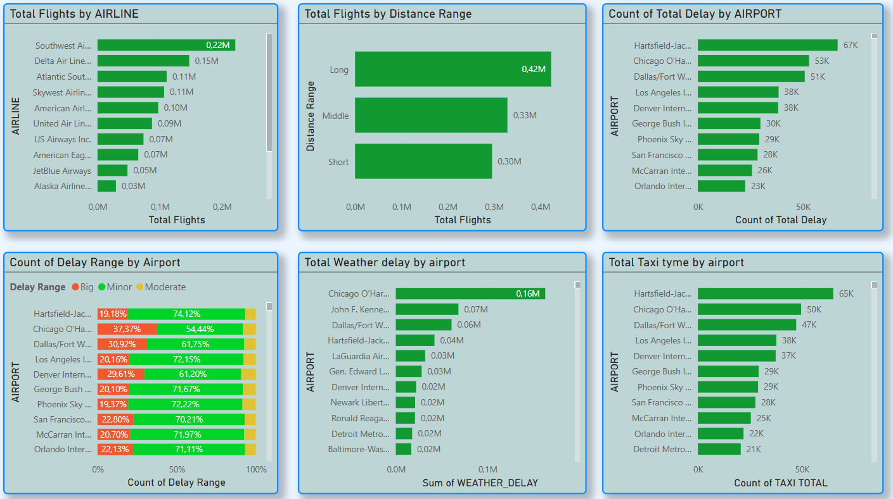

# 🛫 Airports & Airlines – Power BI Report

This Power BI dashboard explores flight schedules, delays, and cancellations across major airports and airlines. Designed for analysts and operations teams, the report helps uncover causes of delays, monitor airline performance, and identify weather-related impacts on travel.

---

## 🎯 Project Goals

- Understand patterns in flight delays and cancellations  
- Identify key reasons affecting flight punctuality  
- Compare airport and airline performance across time and geography  
- Visualize weather-related disruptions and trends  

---

## 📊 Key Features

- 🧭 **Dropdown Filters**: Explore data by airport, city, and airline  
- 🗓️ **Day-of-Week Analysis**: Discover which days most cancellations occur  
- 🌦️ **Weather Impact Map**: Bookmark leads to map of weather-related delays with date slicer  
- 📈 **Delay & Distance Ranges**: Segment flights by distance and delay duration  
- 🧮 **Custom Measures**: Total taxi time, % delayed flights, and velocity metrics  
- 🔁 **Matrix View**: Cross-report of departure vs. destination airports with delay minutes  
- 📊 **KPI Metrics**: Total flights, diverted flights, average distance, no-delay counts, min/max delay  

---

## 🧠 Business Insights

- Identified peak cancellation days and major contributing factors  
- Analyzed delay types (weather, security, carrier, NAS, late aircraft)  
- Visualized airport-specific delays and cancellation causes  
- Compared airline performance in terms of delay percentage and taxi time  
- Mapped weather-related delays with date filter to highlight trends  
- Ranked flights by speed, airtime, and distance  
- Highlighted relationships between origin/destination delays in matrix format  

---

## 🛠 Tools & Techniques

- **Power BI Desktop**  
- **Power Query** for data preparation  
- **DAX Measures** for advanced calculations (e.g., % delayed, average delay time)  
- **Bookmarks & Slicers** for interactive storytelling  
- **Custom Ranges** for delay duration, flight distance, and velocity  

---

## 📂 Files

- `Airports_and_Airlines.pbix` – Main Power BI report  
- `images/` – Folder with report screenshots  
- `Data/` – *(Optional, if safe to share source data)*  

---

## 📌 Learnings

This project enhanced skills in:  
- Advanced DAX for performance metrics  
- Visual storytelling using bookmarks and maps  
- Designing interactive dashboards for operational insights  
- Segmenting flight data to explore multiple delay dimensions  

---

