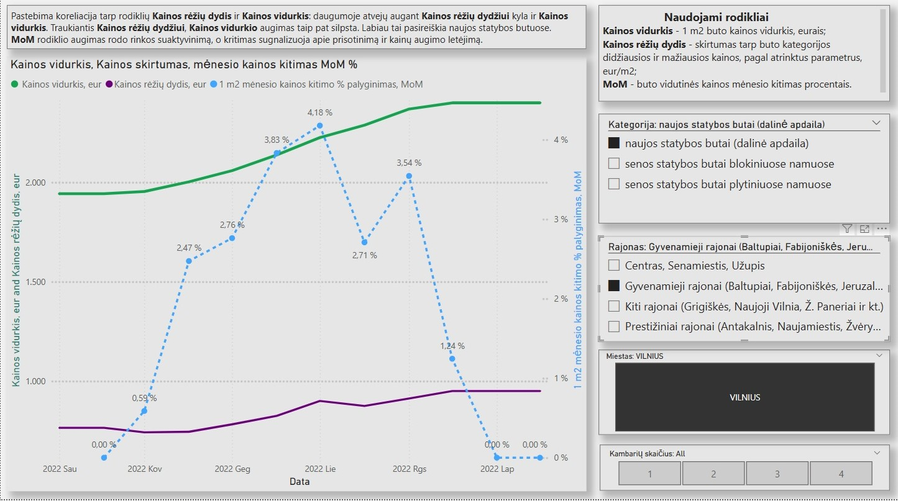
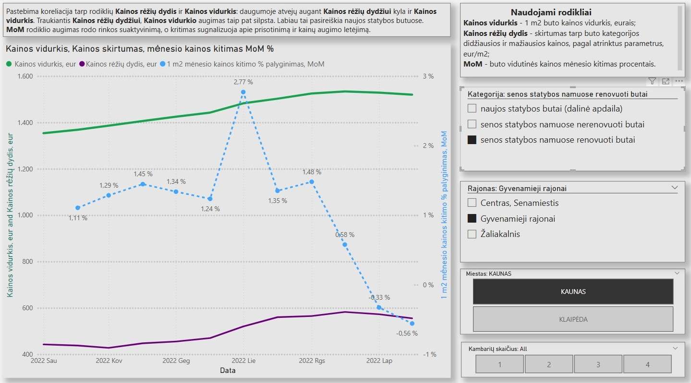
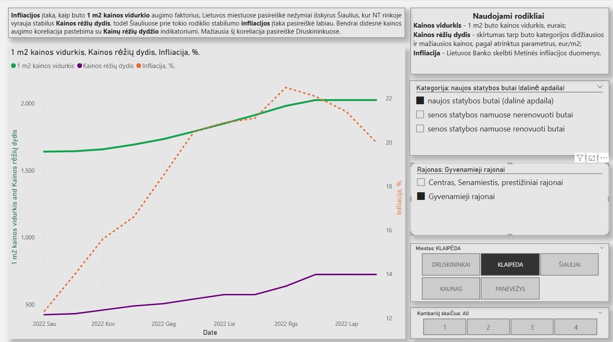
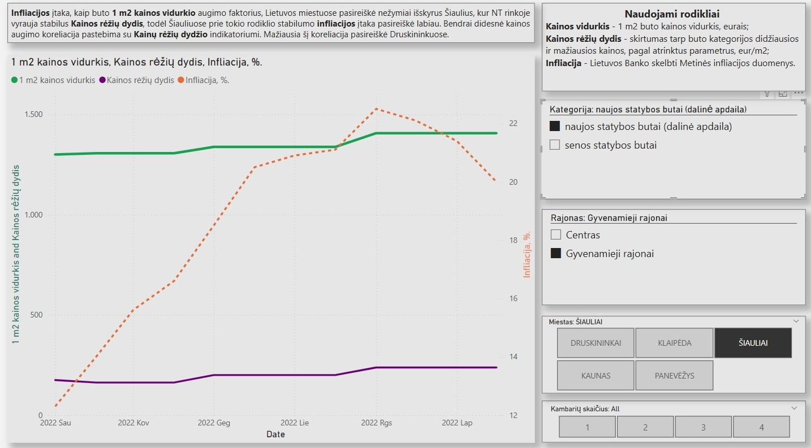
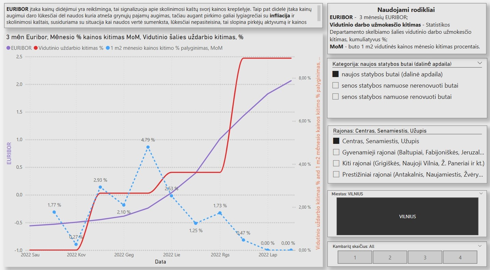

# 🏙️ Šalies miestų butų kainų analizė su Power BI & Python

**Tikslas:**  
Identifikuoti veiksmingus butų rinkos analizės indikatorius, įžvelgti jų tarpusavio koreliacijas ir įvertinti, kaip makroekonominiai veiksniai gali paveikti gyventojų nuomonę apie teisingą būsto kainą.

---

## 📈 Apie projektą

Šiame darbe buvo analizuojamos **gyvenamųjų butų skelbiamos 1 m² kainos** skirtinguose Lietuvos miestuose.  
Pagrindinis tyrimo objektas – **kainų dinamikos vertinimas laike** ir kainų sąsaja su ekonominiais rodikliais.

> ❗ Šiame darbe **nėra vertinami**: pardavimų kiekiai, nuolaidos, finansavimo šaltiniai ir t.t.

---

## 🖼️ Vizualizacijos pavyzdžiai. Galimi pjuviai pagal visus požymius: miestas, rajonas, buto tipas, kambarių skaičius.

### 📊 1. Koreliacija tarp kainos ir Kainų režių dydžio indikatorio

---

### 📊 2. Infliacijos įtaka

---

### 📊 3. Makroekonominiai rodikliai ir kainos kitimas

---

## 🛠️ Naudoti įrankiai

- **Power BI** – vizualizacijos, indikatoriai, skaičiavimai, koreliacijų grafikai
- **Python** – duomenų įkėlimas, skaičiavimai, apdorojimas

---

## 📊 Naudoti duomenų šaltiniai

- [Ober-Haus mėnesinės butų kainų ataskaitos](https://www.ober-haus.lt/rinkos_apzvalgos/kainu-lenteles/)
- Lietuvos statistikos departamentas
- Lietuvos Bankas
- EURIBOR duomenys

---

## 🔍 Naudoti rodikliai

| Rodiklis                               | Aprašymas                                                              |
|----------------------------------------|------------------------------------------------------------------------|
| **Kainos vidurkis**                    | 1 m² buto vidutinė kaina, eurais                                       |
| **Kainos rėžių dydis**                 | Skirtumas tarp mažiausios ir didžiausios butų kainos pagal kategoriją  |
| **MoM**                                | Mėnesinis vidutinės kainos pokytis (%)                                 |
| **Vidutinio darbo užmokesčio kitimas** | Skelbiamo darbo užmokėsčio kumuliatyvus pokytis (%)                    |

---

## 📌 Pagrindinės įžvalgos

- **Infliacija** sąlyginai nedidelė infliacijos įtaka kainai.

- **Kambarių skaičius** įtaka 1 m2 kainai nedidelė, bet reikšmingai įtakoja **MoM indikatorių**. t.y. butai skirtingų kambarių skaičiaus "aktivuojasi" pardavimuose skirtingai.
    
- **Kainos rėžių dydžio indikatorius** parodė stiprią koreliaciją su kainos kitimu.
  
- **MoM indikatorius** buto vidutinės kainos mėnesio kitimas procentais, gali indikuoti apie ateities kainų tendencijas.

---

## 🎯 Pagrindinis tikslas

Suprasti, **kaip rinkos dalyviai vertina teisingą buto kainą** ir kaip tai keičiasi laike.  
Kitaip tariant — **identifikuoti lūkesčius ir nuotaikas** per objektyvius ekonominius rodiklius.

---

