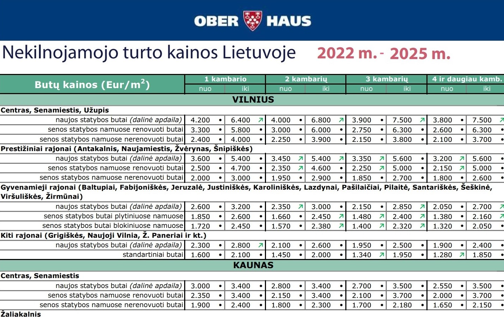
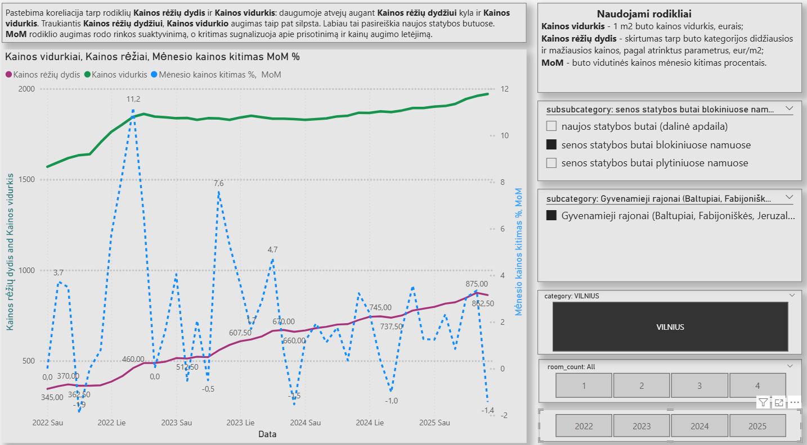
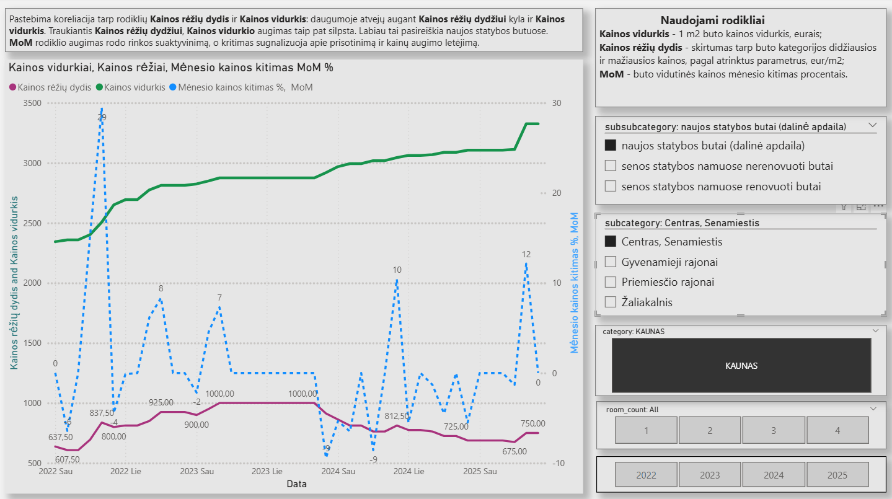
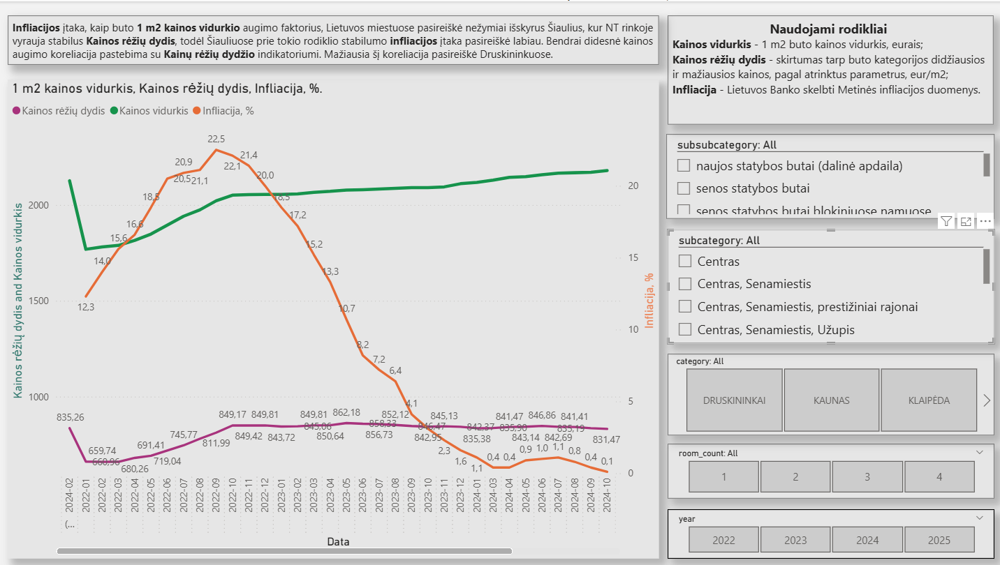
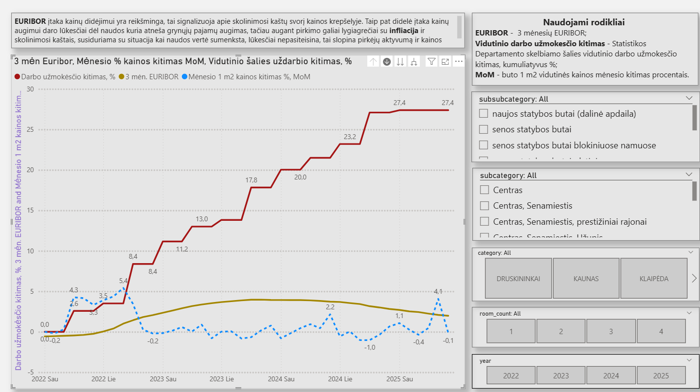
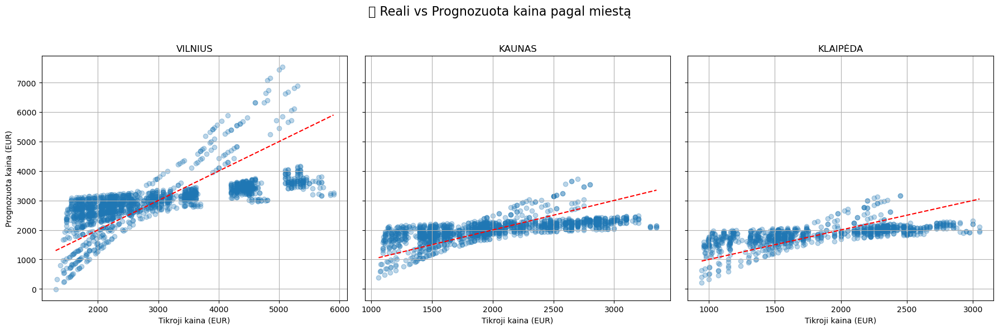
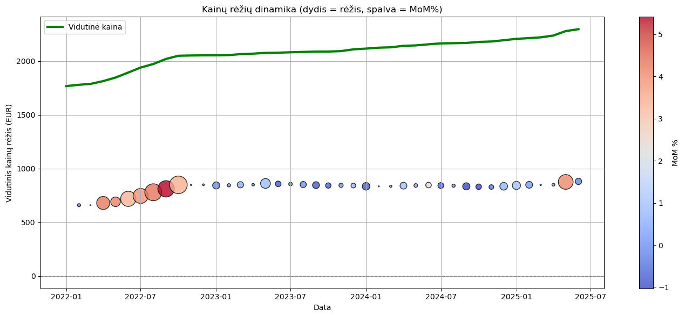
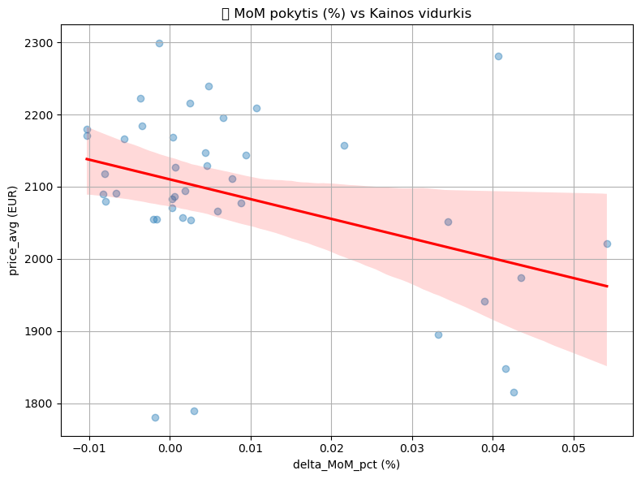
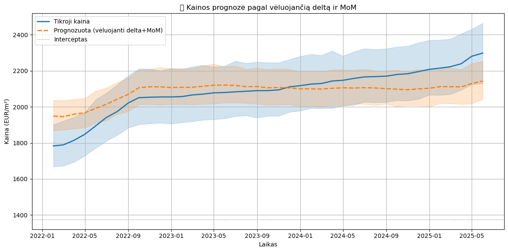

# 🏙️ Šalies miestų butų kainų analizė su Power BI & Python

## 📈 Apie projektą

  Nekilnojamo turto bendrovė Ober-Haus (https://www.ober-haus.lt/apie-mus/) reguliariai skelbia ataskaitas apie mėnesio butų 1 m2 kainas ir sukaupė didelį duomenų kiekį. Didelis kiekis leidžia daryti tikslesnę duomenų analizę įvairiais pjūviais.
Žinau nekilnojamo turto rinka ir ypatumus, todėl nusprendžiau panaudoti duomenų apdorojimo metodus ir panagrinėti ar tie metodai aptiks neatskleistas sąsajas duomenyse.
Nors pati duomenų struktūra nėra gyli, nėra duomenų apie realius pardavimus, nuolaidas, kiekius, pirkėjus, pardavėjus ir panašiai, pamaniau kad visgi dideliame duomenų kiekyje galimai slypi neištirti dėsningumai.

Faktiškai, duomenyse yra tik vienas rodmuo, tai buto 1 m2 kaina, išreikšta kaina NUO ir kaina IKI. Kiti ataskaitose turimi dedamieji atlieka šio rodmens dimensinį skirstymą: buto kambarių skaičius, buto kategorija, rajonas, miestas.
  Galima padaryti prielaidą, kad kaina atspindi pirkėjo ir pardavėjo konsensusą, o kainos kitimas  - to konsensuso paieškos kryptį.
Todėl į šį rodiklį ir buvo nukreiptas pagrindinis dėmėsis.
Taigi, pagrindinis tyrimo objektas – **kainų dinamikos vertinimas laike**, kainų sąsaja su ekonominiais rodikliais ir dėsningumų paieška.

## Tikslas:  
Identifikuoti veiksmingus butų kainų analizės indikatorius, įžvelgti jų tarpusavio koreliacijas ir įvertinti, kaip makroekonominiai rodikliai gali paveikti rinkos dalyvių nuomonę apie teisingą būsto kainą.

---
## 🛠️ Naudoti įrankiai

- **Power BI** – vizualizacijos, indikatoriai, skaičiavimai, koreliacijų grafikai
- **Python** – duomenų transformavimas, įkėlimas, skaičiavimai, apdorojimas
---

## 📊 Naudoti duomenų šaltiniai

- [Ober-Haus mėnesinės butų kainų ataskaitos](https://www.ober-haus.lt/rinkos_apzvalgos/kainu-lenteles/)
  
- Analizei paimtas 40 mėnesių periodas (**7057** įrašai)  
- Lietuvos statistikos departamentas
- Lietuvos Bankas
- EURIBOR duomenys
  
## Naudoti mėtodai

🧹 1. Duomenų paruošimas
-	PDF lentelių ištraukimas su pdfplumber
-	Stulpelių konvertavimas 
-	Data normalizavimas į datetime 
________________________________________
🔁 2. Laiko eilutės transformacijos
-	Grupavimas 
-	Lag skaičiavimai: delta_lag1, MoM_lag1 – vėluojantys rodikliai (nuo praeito mėnesio)
________________________________________
📊 3. Regresinė analizė
-	Multiple Linear Regression su sklearn.linear_model.LinearRegression
o	Naudota:
	kainų rėžių dydis
	delta_MoM_% (kiek % kito vidutinė kainą palyginus su praeitų mėnesių)
	Infliacija, Euribor 3 mėn., vidutinio šalies darbo užmokėsčio kitimas (kaupiamasis, %)
	Sintetinis rodiklis: Santykinis_skirtumas = vidutinė kaina / darbo užmokesčio kitimas
-	StandardScaler – nepriklausomų kintamųjų standartizavimas 
________________________________________
📈 4. Statistinė analizė su statsmodels (OLS)
-	statsmodels.OLS (Ordinary Least Squares) modeliai:
-	Atskiras modelis su makro rodikliais
-	Atskiras modelis su delta + MoM
-	Atskiras modelis su delta_lag1, MoM_lag1 (poveikis kainai vieną mėnesį į priekį)
-	Pateikti rodikliai:
-	coef – koeficientai
-	R², Adj. R²
-	t, p-value – reikšmingumo testai
-	AIC, BIC – modelio kokybės kriterijai
________________________________________
📉 5. Modelio kokybės vertinimas
Naudotos šios metrikos:
-	R² – determinacijos koeficientas
-	MAE – vidutinė absoliuti paklaida
-	RMSE – šakninis vidutinis kvadratinis nuokrypis
-	MSE – vidutinis kvadratinis nuokrypis
________________________________________
🎨 6. Vizualizacijos
-	Scatter grafikai su:
-	**Taškų dydžiu pagal kainų rėžių dydį**
-	**Spalvine temperatūra pagal MoM**
-	Laiko eilučių grafikų interpretacijos:
-	Reali vs prognozuota kaina

## 🎯 Pagrindinis šio darbo tikslas

Suprasti, **kaip rinkos dalyviai vertina teisingą buto kainą** ir kaip tai keičiasi laike.  
Kitaip tariant — **identifikuoti lūkesčius ir nuotaikas** per objektyvius ekonominius rodiklius.

# Rezultatai

## 📊 1 m2 buto kainų ir makroekonominių indikatorių sąsajos analizė

Naudoti indikatoriai:
•	3 mėn. EURIBOR
•	Infliacija
•	Šalies vidutinio darbo užmokesčio kaupiamasis prieaugis, %

## 🖼️ Vizualizacijos pavyzdžiai. 
      Galimi pjuviai pagal visus požymius: miestas, rajonas, buto tipas, kambarių skaičius.

### 📊 1. Koreliacija 1 m2 buto kainos ir Kainų rėžių dydžio indikatoriaus

---

### 📊 2. Infliacijos įtaka

---

### 📊 3. Makroekonominiai rodikliai ir kainos kitimas

---

## 🔍 Naudoti išvestiniai rodikliai

| Rodiklis                               | Aprašymas                                                              |
|----------------------------------------|------------------------------------------------------------------------|
| **Kainos vidurkis**                    | 1 m² buto vidutinė kaina, eurais                                       |
| **Kainos rėžių dydis (KR)**            | Skirtumas tarp mažiausios ir didžiausios butų kainos pagal kategoriją  |
| **MoM**                                | Mėnesinis vidutinės kainos pokytis (%)                                 |
| **Vidutinio darbo užmokesčio kitimas** | Skelbiamo darbo užmokesčio kumuliatyvus pokytis (%)                    |

---

## 📌 Pagrindinės įžvalgos

- **Infliacija**: Sąlygotinai nedidelė infliacijos įtaka kainai. Darant skaičiavimus, modelis remiasi faktu kad infliacijai sumažėjus, butų kainos ne mažėja o toliau brangsta.

- **Kambarių skaičius**: Įtaka 1 m2 kainai nedidelė, bet šis rodiklis reikšmingai įtakoja **MoM indikatorių**. t.y. butai skirtingų kambarių skaičiaus "aktyvuojasi" pardavimuose skirtingai.
    
- **Kainos rėžių dydžio indikatorius**: Parodė stiprią koreliaciją su kainos kitimu, gali indikuoti apie ateities kainų tendencijas.
  
- **MoM indikatorius**: Buto vidutinės kainos mėnesio kitimas procentais, gali indikuoti apie ateities kainų tendencijas.

________________________________________
## 1. 📊 1 m2 buto kainų ir makroekonominių indikatorių sąsajos analizė

Naudoti indikatoriai:
•	Sintetinis indikatorius Santykinis_skirtumas (kiek kainuoja butas, palyginus su pajamų augimo tempu)
•	Infliacija
•	Šalies vidutinio darbo užmokesčio prieaugis, % (Kitimas)
•	3 mėn. EURIBOR

📈 Koeficientai: [1134.9, 723.1 , 1032.3,   808.3]
📍 Interceptas: 2101.83

Santykinis_skirtumas = 1134.9, didžiausias poveikis. Rodo, kad kad kai didėja kainų "išsklidimas", didėja ir vidutinė kaina.
Kitimas (darbo užmokesčio prieaugis, %) = 1032.3. Artimas poveikiui, galimai nusako apie aktyvumo dinamika.
Euribor3 = 808.3 – gana stiprus veiksnys, rodo, kad palūkanų normos įtakoja kainas, lėtina augimą, poveikis priklauso nuo laikotarpio.
Infliacija = 723.1. Taip pat daro įtaką, bet šiek tiek mažesnę nei kiti.

📉 MAE: 364.21 EUR
📉 RMSE: 459.49 EUR
📉 MSE: 211126.63 EUR²

📊 OLS regresijos rezultatas ir bendras modelio vertinimas:

|Rodiklis             	|Reikšmė	         |Paaiškinimas
|-----------------------|------------------|----------------------------------------------------------------------------------------------------|
|R-squared	            |   0.771       	 |Modelis paaiškina 77,1% kainos vidurkio kitimą.                                                     |
|Adj. R-squared	        |   0.771	         |Pataisytas R², atsižvelgiant į kintamųjų skaičių. Mažai skiriasi nuo R², visi kintamieji reikšmingi.|
|F-statistic / Prob(F)	|   5501, 0.000	   |Modelis statistiškai reikšmingas (p < 0.001).                                                       |
-------------------------------------------------------------------------------------------------------------------------------------------------

📉 Kintamųjų įtaka (coef + p-vertės) 

|Kintamasis	           |Koeficientas	    |P reikšmė	       |Interpretacija                                                                                                                   |
|----------------------|------------------|------------------|---------------------------------------------------------------------------------------------------------------------------------|
|Intercept (const)     | 1017.19        	|< 0.001	         |Kai visi prediktoriai = 0, vidutinė buto kaina būtų ~1017 € (be kitų faktorių).                                                  |
|price_delta	         |   +1.145	        |< 0.001 ✅        |Labai stipri įtaka: kainų rėžiams padidėjus 1 EUR, vidutinė kaina didėja apie 1.15 EUR. Tai pagrindinis prognozuojantis veiksnys.|
|Infliacija	           |   +0.59	        |  0.675 ❌        |Statistiškai nereikšminga. **Šioje regresijoje įtakos neturi** (nėra koreliacijos su kaina).                                        |
|Kitimas (DU)          |  +10.01        	|< 0.001 ✅        |Darbo užmokesčio augimas 1% = kainos augimas apie 10 EUR – statistiškai reikšminga.                                              |
|Euribor3	             |  −14.55	        |  0.008 ✅        |Euribor didėjimas 1 p.p. = kainos mažėjimas apie 14.5 EUR.                                                                       |
------------------------------------------------------------------------------------------------------------------------------------------------------------------------------------------

Koreliacija su delta: 0.874
Koreliacija su delta_MoM: -0.011
_______________________________________

## 2. 📊 Nekilnojamo turto išvestinių indikatorių **Kainų rėžių dydis** + **Kainos vidurkio kitimas %** (delta + MoM) ir buto 1 m2 kainos vidurkio sąsajos analizė

📈 Koeficientai: [828.42370401 -15.32693714]
📍 Interceptas: 2086.38

📉 MAE: 364.21 EUR     Vidutinė absoliuti klaida – kiek modelis vidutiniškai klysta.
📉 RMSE: 459.49 EUR    Klaidos standartinis nuokrypis – šiek tiek didesnis nei MAE, nes jautresnis ekstremaliems atvejams
📉 MSE                 Bendras kvadratinis klaidos dydis, prastai interpretuojama pinigais.

📊 OLS regresijos rezultatas ir bendras modelio vertinimas:

|Rodiklis             	|Reikšmė	         |Paaiškinimas
|-----------------------|------------------|----------------------------------------------------------------------------------------------------|
|R-squared	            |   0.765       	 |Modelis paaiškina 76,5% kainos vidurkio kitimą.                                                     |
|Adj. R-squared	        |   0.765	         |Patvirtina R², atsižvelgiant į kintamųjų skaičių.                                                   |
|F-statistic / Prob(F)	|   10390, 0.000	 |Modelis statistiškai reikšmingas (p < 0.001).                                                       |
-------------------------------------------------------------------------------------------------------------------------------------------------

📉 Kintamųjų įtaka (coef + p-vertės)

|Kintamasis	           |Koeficientas    	|P > t reikšmė  | Interpretacija                                                                                                                    |
|----------------------|------------------|---------------|-----------------------------------------------------------------------------------------------------------------------------------|
|Intercept (const)     | 1143.01        	|< 0.001	      |Kai visi prediktoriai = 0, vidutinė buto kaina būtų ~1143 € / m2 (be kitų faktorių).                                               |
|price_delta	         |   +1.1503	      |< 0.001 ✅    |Stipri įtaka: kainų rėžiams padidėjus 1 EUR, vidutinė kaina didėja apie 1.15 EUR. Tai pagrindinis prognozuojantis veiksnys.        |
|delta_MoM-pct         |   -2.3291	      |  0.00  ✅    |Neigiamas poveikis:kai delta greitai keičiasi, trumpalaikiai spaudžia kainą žemyn.                                                 |
----------------------------------------------------------------------------------------------------------------------------------------------------------------------------------------------

 

 MoM dydis atvaizduotas spalvotai. Spalva kinta nuo žemo rodmens (mėlyna) iki aušto (raudona). Taškų dydis rodo delta reikšmė: didesnis taškas reiškia deltos (Kainos rėžių dydis) padidėjimą.
 Grafikas rodo, kaip dideli taškai signalizuoja apie kainos kilimą ir kaip sumažėję taškai signalizuoja apie kainos kilimo pabaigą. Gerai matosi delta ir MoM koreliacija.

🟠 Išvados:
--------------------------------------------------------------------------------------------------------------------------------------
- 	price_delta yra stiprus prognozės kintamasis                                                                               
- 	delta_MoM_pct yra statistiškai reikšmingas, atskiro rodiklio poveikis ne toks stiprus, kartu su delta sustiprina kainos trendą. Trumpalaikiu šuoliai sukuria outliner (išskiriančias) reikšmes
      Galima daryti prielaidą kad tokiais šuoliais jis provokuoja kito mėnesio kainos vidurkio išjudinimą, o kai jo reikšmes mažos, kainos grupuojasi arti esamo vidurkio.
- 	Durbin-Watson: 0.848 → likučiai priklauso nuo laiko, rekomenduojamas time series modelis arba lag kintamųjų modelis.           
- 	Condition Number: 1660 → nėra didelis, bet signalizuoja, kad kai kurie kintamieji galbūt koreliuoja.                           
--------------------------------------------------------------------------------------------------------------------------------------

✅ Apibendrinimas:
Modelis:
-	Tinkamas, interpretuojamas.
-	Aiškiai rodo, kad kainų rėžiai (price_delta) yra geras trumpalaikis kainos kitimo rodiklis.
-	MoM pokytis taip pat turi įtaką rinkos aktyvumo išjudinimui.
-	Modelio tikrinimui reikia papildomo testo su lag (delta_lag1, MoM_lag1 – vėluojantys rodikliai (nuo praeito mėnesio)).
________________________________________

## 3. 📊 delta_lag1, MoM_lag1 – vėluojantys rodikliai (nuo praeito mėnesio)

Lag delta+ MoM
📉 Kintamųjų įtaka (coef + p-vertės)

|Kintamasis	           |Koeficientas    	|P > t reikšmė   | Interpretacija                                                                                                                      |
|----------------------|------------------|----------------|-------------------------------------------------------------------------------------------------------------------------------------|
|Intercept (const)     | 1146.62        	|< 0.001	       |Kai visi prediktoriai = 0, vidutinė buto kaina būtų ~1146 € / m2 (be kitų faktorių).                                                 |
|delta_lag1 	         |   +1.1496	      |< 0.001 ✅     |Stipri įtaka: kainų rėžiams padidėjus 1 EUR, po mėnesio vidutinė kaina didėja apie 1.15 EUR. Tai pagrindinis prognozuojantis veiksnys.|
|MoM_lag1              | -229.596 	      |  0.00  ✅     |Neigiamas poveikis:kai delta greitai keičiasi, po mėnesio kainos rėžiai susitraukia.                                                 |
----------------------------------------------------------------------------------------------------------------------------------------------------------------------------------------------
 

🔍  - Prognozuota reikšmė prieš 1 m2 kainos pakilimą yra aukštesnė už tikrą kainą, kai ji kyla.
     - Paaiškinimas:delta ir MoM indikatoriai reaguoja greičiau nei pati kaina. Kitaip tariant — jie turi prognostinę galią.

🔚 Apibendrinimas
- ✔️ 	price_delta ir delta_MoM_pct nėra tiesioginė kainos išraiška, o tik signalas.
- ✔️	Jie labiau veikia kaip rinkos aktyvumo ir temperatūros indikatoriai.
- ✔️	Naudojant juos tinkamai su laiko lagais, jie gali padėti prognozuoti kainos kilimą arba kritimą.

## 🎯 Ar pasiektas tikslas?

Tinkamas išvestų indikatorių panaudojimas turi prognozuojamą reikšmė **kaip rinkos dalyviai vertina teisingą buto kainą** ir kaip tai keičiasi laike.  
Jų kombinacija leidžia su didele tikimybė **identifikuoti rinkos dalyvių lūkesčius ir nuotaikas**.
- ✅ **Darbo tikslai pasiekti**.

