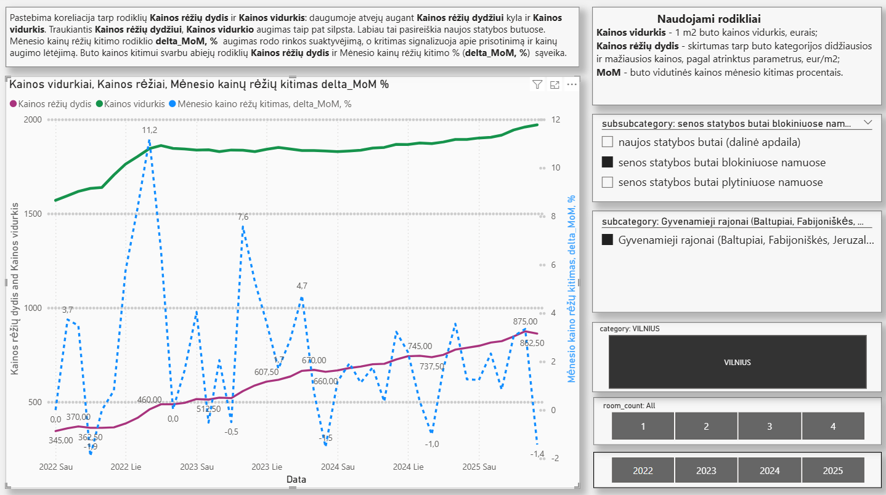
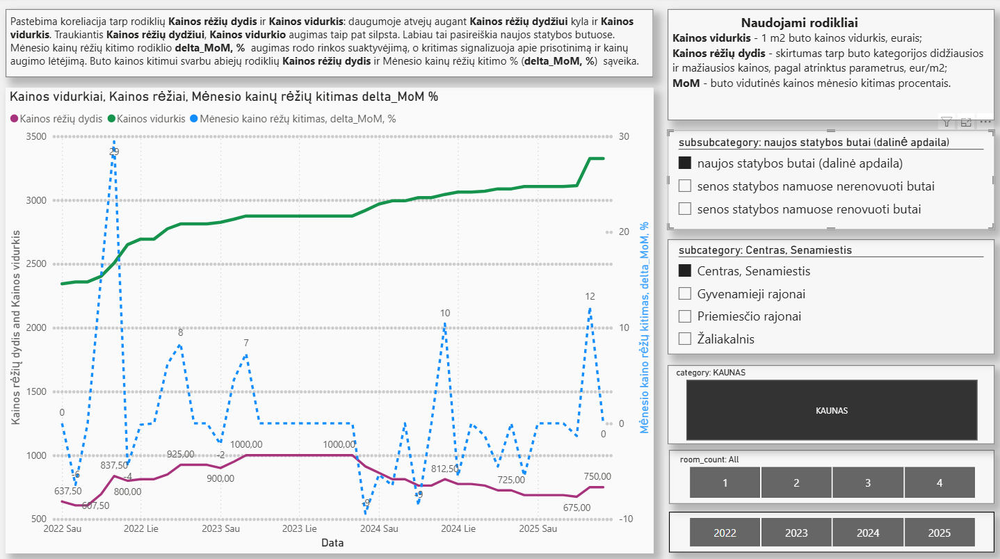
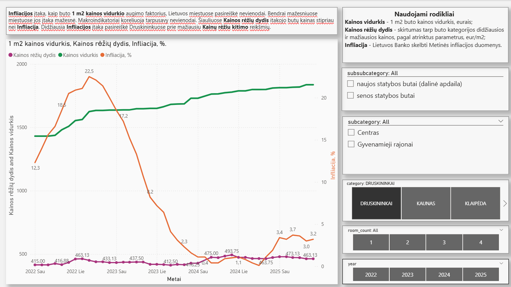
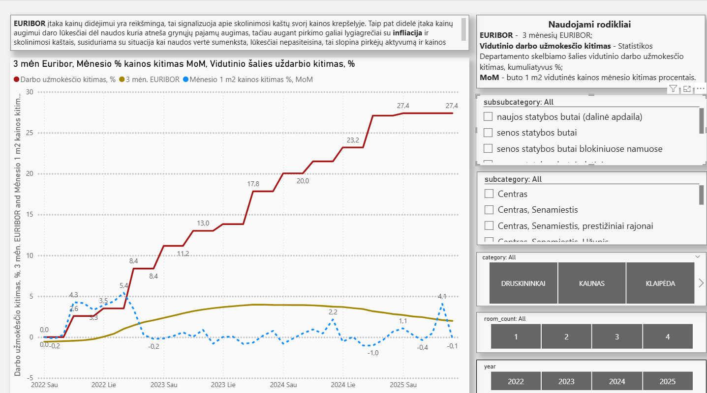
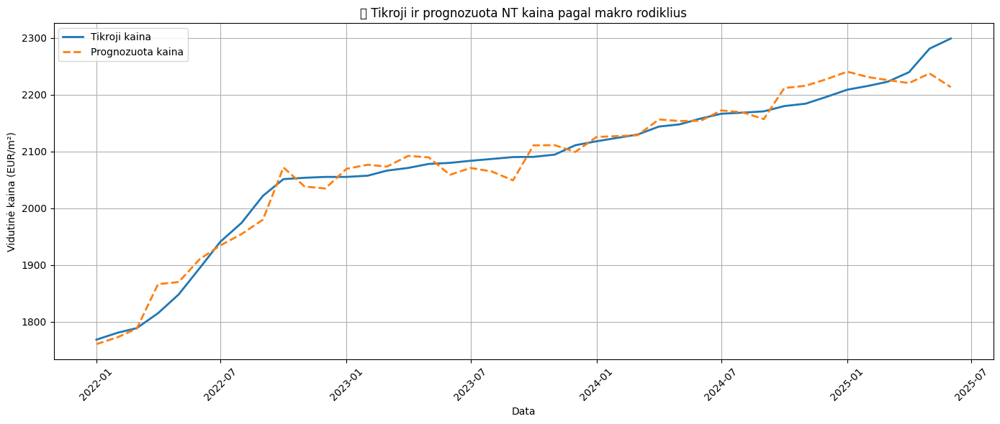
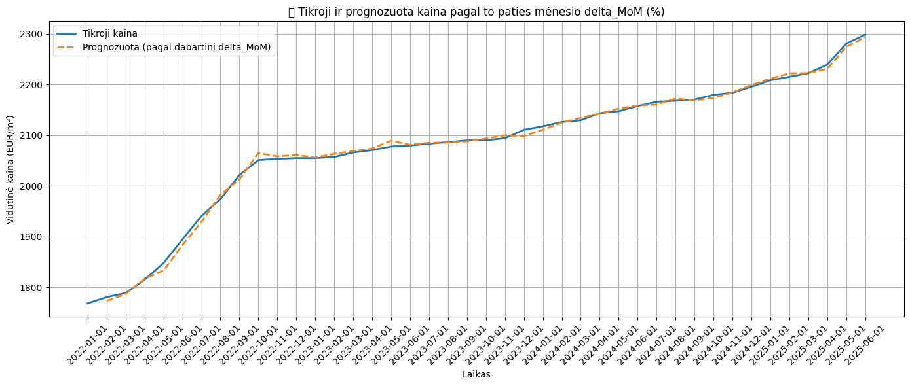
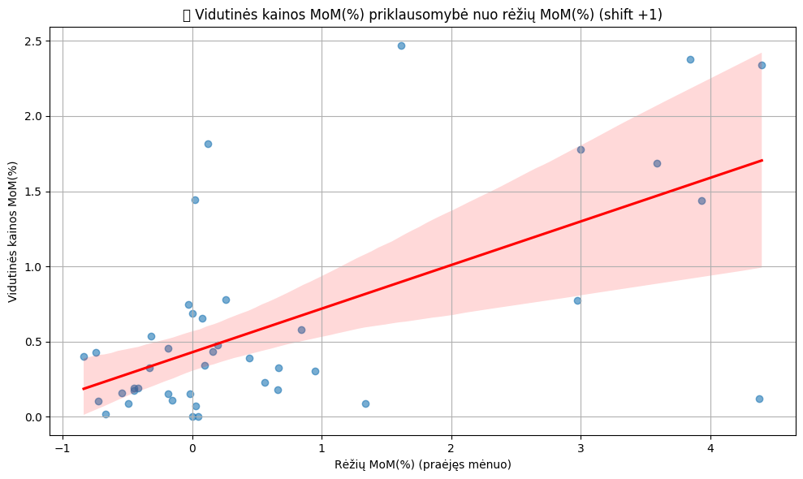
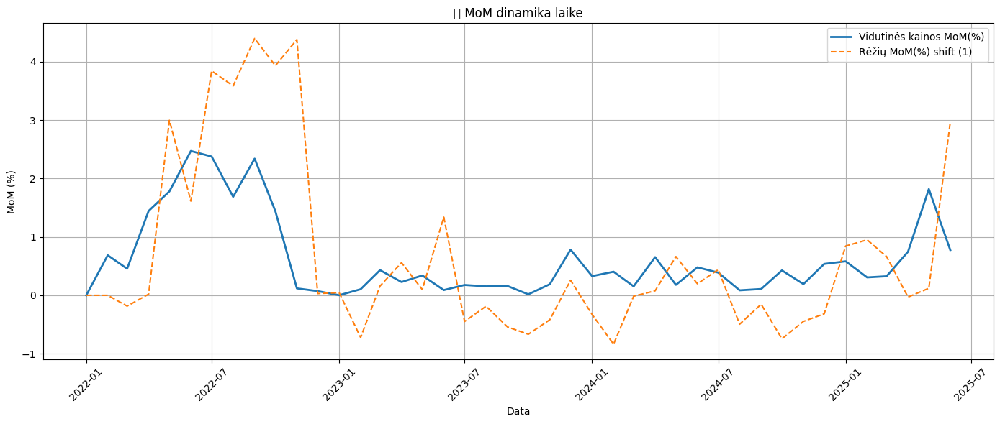
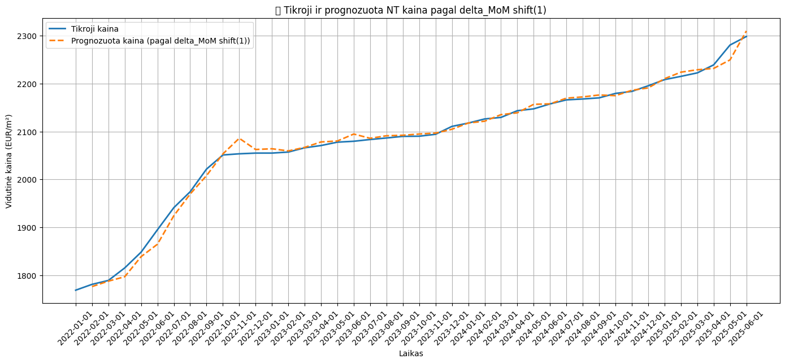

# 🏙️ Ober-Haus ataskaitų statistinė analize. Šalies miestų butų kainos.

## 📈 Apie projektą

  Nekilnojamo turto bendrovė Ober-Haus (https://www.ober-haus.lt/apie-mus/) reguliariai skelbia ataskaitas apie mėnesio butų 1 m2 kainas ir sukaupė didelį duomenų kiekį. Didelis kiekis leidžia daryti tikslesnę duomenų analizę įvairiais pjūviais.
Žinau nekilnojamo turto rinka ir ypatumus, todėl nusprendžiau panaudoti duomenų apdorojimo metodus ir panagrinėti ar tie metodai aptiks neatskleistas sąsajas duomenyse.
Nors pati duomenų struktūra nėra gyli, nėra duomenų apie realius pardavimus, nuolaidas, kiekius, pirkėjus, pardavėjus ir panašiai, pamaniau kad visgi dideliame duomenų kiekyje galimai slypi neištirti dėsningumai.

  Faktiškai, duomenyse yra tik vienas rodmuo, tai buto 1 m2 kaina, išreikšta kaina NUO ir kaina IKI. Kiti ataskaitose turimi dedamieji atlieka šio rodmens dimensinį skirstymą: buto kambarių skaičius, buto kategorija, rajonas, miestas. Unikalių dimensijų derinių (miestas + rajonas + buto kategorija + kambarių skaičius) yra 156, taigi ketinu nustatyti kainos parametrus kiekvienam deriniui ir operuoti šių derinių parametrų vidurkiais kaip apibendrintais rezultatais.
  
  Padariau prielaidą, kad kaina atspindi pirkėjo ir pardavėjo konsensusą, o kainos kitimas  - to konsensuso paieškos kryptį.
Todėl į šį aspektą ir buvo nukreiptas pagrindinis dėmėsis.
Taigi, pagrindinis tyrimo objektas – **kainų dinamikos vertinimas laike**, kainų sąsaja su ekonominiais rodikliais ir dėsningumų paieška.

## Tikslas:  
Identifikuoti veiksmingus butų kainų analizės indikatorius, įžvelgti jų tarpusavio koreliacijas ir įvertinti, kaip makroekonominiai rodikliai gali paveikti rinkos dalyvių nuomonę apie teisingą būsto kainą.

---
## 🛠️ Naudoti įrankiai

- **Power BI** – vizualizacijos, indikatoriai, skaičiavimai, koreliacijų grafikai
- **Python** – duomenų transformavimas, įkėlimas, skaičiavimai, apdorojimas
- **Excel** - duomenų apdorojimas, modeliavias
---

## 📊 Naudoti duomenų šaltiniai

- [Ober-Haus mėnesinės butų kainų ataskaitos](https://www.ober-haus.lt/rinkos_apzvalgos/kainu-lenteles/)
  
- Analizei paimtas 42 mėnesių periodas (random=42), kuriose yra **7057** įrašai
- Lietuvos statistikos departamentas
- Lietuvos Bankas
- EURIBOR duomenys
  
## Naudoti mėtodai

🧹 1. Duomenų paruošimas
-	PDF lentelių ištraukimas su pdfplumber
-	Stulpelių konvertavimas 
-	Data normalizavimas į datetime 
________________________________________
🔁 2. Laiko eilutės transformacijos
-	Grupavimas pagal unikalius derinius
-	Laiko slinkimo skaičiavimai: price_delta_MoM(%) shift (1), būsimo mėnesio
________________________________________
📊 3. Regresinė analizė

 Multiple Linear Regression su sklearn.linear_model.LinearRegression

 Naudota:
-	vidutinė (visų derinių) kaina
-	vidutinės kainos rėžių dydis (nuo : iki)
-	price_delta_MoM(%) (kiek % kito vidutinės kainos rėžiai palyginus su praeitų mėnesių)
-	price_avg_MoM(%) (kiek % kito vidutinė kainą palyginus su praeitų mėnesių)
-	Infliacija, Euribor 3 mėn., vidutinio šalies darbo užmokėsčio kitimas (kaupiamasis, %)
-	StandardScaler – nepriklausomų kintamųjų standartizavimas 
________________________________________
📈 4. Statistinė analizė su statsmodels (OLS)
-	statsmodels.OLS (Ordinary Least Squares) modeliai:
-	Atskiras modelis su makro rodikliais
-	Atskiras modelis su price_delta_MoM
-	Atskiras modelis su kainos rėžių (price_deltaMoM) paslinkimu (shift (1)), kaip prognoze kainai vieną mėnesį į priekį
-	Pateikti rodikliai:
-	coef – koeficientai
-	R², Adj. R²
-	t, p-value – reikšmingumo testai
________________________________________
📉 5. Modelio kokybės vertinimas

Naudotos šios metrikos:
-	R² – determinacijos koeficientas
-	MAE – vidutinė absoliuti paklaida
-	RMSE – šakninis vidutinis kvadratinis nuokrypis
-	MSE – vidutinis kvadratinis nuokrypis
________________________________________
🎨 6. Vizualizacijos
-	Linijimai ir Scatter grafikai su:
-	**Taškų dydžiu pagal kainų rėžių dydį**
-	**Spalvine temperatūra pagal price_delta_MoM kitimo mastą**
-	Laiko eilučių grafikų interpretacijos:
-	Reali vs prognozuota kaina

## 🎯 Pagrindinis šio darbo tikslas

Suprasti, **kaip rinkos dalyviai vertina teisingą buto kainą** ir kaip tai keičiasi laike.  
Kitaip tariant — **identifikuoti lūkesčius ir nuotaikas** per objektyvius ekonominius rodiklius.

# Rezultatai

## 🖼️ Vizualizacijos pavyzdžiai. 
      Galimi pjuviai pagal visus požymius: miestas, rajonas, buto tipas, kambarių skaičius.

### 📊 1. Koreliacija 1 m2 buto kainos ir Kainų rėžių dydžio indikatoriaus

---

### 📊 2. Infliacijos įtaka

---

### 📊 3. Makroekonominiai rodikliai ir kainos kitimas

---

## 🔍 Naudoti rodikliai

|Rodiklis                                |Aprašymas                                                                   |
|----------------------------------------|----------------------------------------------------------------------------|
|Kainos vidurkis                         | 1 m² buto vidutinė kaina, eurais                                           |
|Kainos rėžių dydis (KR)                 | Skirtumas tarp mažiausios ir didžiausios butų kainos pagal derinį, vidurkis|
|delta_MoM                               | Mėnesinio kainų rėžio pokytis (%)                                          |
|Vidutinio darbo užmokesčio prieaugis    | Skelbiamo darbo užmokesčio kumuliatyvus pokytis (%)                        |
|Makro indikatoriai                      | EURIBOR, Infliacija, Darbo užmokestis                                      |               
-----------------------------------------------------------------------------------------------------------------------

## 📌 Pagrindinės įžvalgos

- **Makro indikatoriai**: Visi prediktoriai statistiškai reikšmingi ((P < 0.05), turi prognostinį potencialą.

- **Kambarių skaičius**: Įtaka 1 m2 kainai nedidelė, bet šis rodiklis reikšmingai įtakoja **delta_MoM** indikatorių. t.y. butai skirtingų kambarių skaičiaus "aktyvuojasi" pardavimuose skirtingai.
    
- **Kainos rėžių dydžio** indikatorius: Parodė stiprią koreliaciją su kainos kitimu.
  
- **delta_MoM** indikatorius: Kainų rėžių mėnesio kitimas procentais, gali indikuoti apie ateities kainų tendencijas.

________________________________________
## 1. 📊 1 m2 buto kainų ir makroekonominių indikatorių sąsajos analizė

Naudoti indikatoriai:
•	price_delta_MoM
•	Infliacija
•	Šalies vidutinio darbo užmokesčio prieaugis, % (Kitimas (DU))
•	3 mėn. EURIBOR

📉 MAE:  19,33 EUR
📉 RMSE: 25,09 EUR/m2
📉 MSE: 629,71 EUR²

📊 OLS regresijos rezultatas ir bendras modelio vertinimas:

|Rodiklis             	|Reikšmė	         |Paaiškinimas
|-----------------------|------------------|----------------------------------------------------------------------------------------------------|
|R-squared	            |   0.9638       	 |Modelis paaiškina 96,4 % kainos vidurkio kitimą. Labai aukštas                                      |
|Adj. R-squared	        |   0.96	         |Pataisytas R², atsižvelgiant į kintamųjų skaičių. Mažai skiriasi nuo R², visi kintamieji reikšmingi.|
-------------------------------------------------------------------------------------------------------------------------------------------------

📉 Kintamųjų įtaka (coef + p-vertės) 

|Kintamasis	           |Koeficientas	    |P reikšmė	     |Interpretacija                                                                                                                   |
|----------------------|------------------|----------------|---------------------------------------------------------------------------------------------------------------------------------|
|Intercept (const)     | 1683,61        	|< 0.001	       |Kai visi prediktoriai = 0, vidutinė buto kaina būtų ~1684 € (be kitų faktorių).                                                  |
|price_delta_MoM       |   9,31 	        |< 0.018         |Stipri įtaka: kainų rėžiams padidėjus 1 EUR, vidutinė kaina didėja apie 9.31 EUR.                                                |                                |Infliacija	           |   7,66 	        |< 0.0001        |Infliacijos augimas 1 p.p. = kainos augimas apie 8 EUR.                                                                          |
|Kitimas (DU)          |  16,04         	|< 0.0001        |Darbo užmokesčio augimas 1 p.p. = kainos augimas apie 16 EUR.                                                                    |
|Euribor3	             |  30,53 	        |< 0.0001        |Euribor didėjimas 1 p.p. = kaina didėja apie 30,53 EUR.                                                                          |
----------------------------------------------------------------------------------------------------------------------------------------------------------------------------------------------

Lentelėje pateikti rodikliai yra apibendrintas visų miestų vidurkis, tačiau aptikta įdomesnių skirtumų apie Infliacijos ir EURIBOR įtaką:

- mažesniuose miestuose šių rodyklių įtaką ženkliai mažėja. Pavyzdžiui, Vilniuje EURIBOR įtakos koeficientas 103,92, o Klaipėdoje 22,56. Tai gali indikuoti apie žemesnį skolinimosi lygį, kai paskolos kainą mažiau reikšmingą identifikuojant teisingą buto kainą ✅
______________________________________  
Statistinio prognozavimo apibendrintas rezultatas patvirtina aukštą makro indikatorių koreliaciją su kaina.

______________________________________

## 2. 📊 Butų kainos išvestinių indikatorių **Kainų rėžių dydis (KR)** + **Mėnesinis kainų rėžio pokytis, % (delta_MoM)** ir buto 1 m2 kainos vidurkio sąsajos analizė

Naudoti indikatoriai:
•	price_delta_MoM (%)
•	price_avg_MoM (%)

📉 MAE: 0,25, 📉 RMSE: 0,32, 📉 MSE: 0,1

📊 OLS regresijos rezultatas ir bendras modelio vertinimas:

|Rodiklis             	|Reikšmė	         |Paaiškinimas
|-----------------------|------------------|----------------------------------------------------------------------------------------------------|
|R-squared	            |     0.787      	 |Modelis paaiškina 78,7% kainos vidurkio kitimą.                                                     |
|Adj. R-squared	        |     0.782	       |Patvirtina R², atsižvelgiant į kintamųjų skaičių.                                                   |
|F-statistic / Prob(F)	|   148,2 / 0.000	 |Modelis statistiškai reikšmingas (p < 0.001).                                                       |
-------------------------------------------------------------------------------------------------------------------------------------------------

📉 Kintamųjų įtaka (coef + p-vertės)

|Kintamasis	           |Koeficientas    	|P > t reikšmė  | Interpretacija                                                                                                                        |
|----------------------|------------------|---------------|---------------------------------------------------------------------------------------------------------------------------------------|
|Intercept (const)     |    0,3437       	|< 0.000	      |Kai price_delta_MoM = 0, prognozuojamas price_avg_MoM yra +0.34%. T.y. net kai price_delta_MoM nejudėjo, kaina vis tiek šiek tiek kyla.|
|price_delta_MoM       |    0.41  	      |< 0.000        |Kai kainų rėžių MoM % (kitimas palyginus su praeitu mėn.)  padidėja 1 proc., vidutinės kainos kitimas padidėja apie 0.41 proc          |
--------------------------------------------------------------------------------------------------------------------------------------------------------------------------------------------------

 

 price_delta_MoM dydis atvaizduotas spalvotai. Spalva kinta nuo žemiausio rodmens (mėlyna) iki auščiausio (raudona). Taškų dydis rodo price_delta_MoM reikšmė: didesnis taškas reiškia deltos (Kainos rėžių dydžio) didesnę reikšmę.
 Grafikas rodo, kaip dideli taškai signalizuoja apie kainos kilimą ir kaip sumažėję taškai signalizuoja apie kainos kilimo pabaigą. Gerai matosi price_delta_MoM ir kainos koreliacija.

🟠 Išvados:
--------------------------------------------------------------------------------------------------------------------------------------
- 	price_delta_MoM yra stiprus prognozės kintamasis. Kartu su price_avg_MoM gerai parodo ryšį tarp buto kainos ir kainų rėžių kitimo, nužymi vyraujantį butų kainos trendą. Didesnių price_delta_MoM reikšmių šuoliai sukuria outlier (išskiriančias) reikšmes
  
     

  	Galima daryti prielaidą kad tokiais šuoliais provokuojamas kito mėnesio kainos vidurkio išjudinimas, ir tai įtakos butų kainos vidurkį. Kai price_delta_MoM reikšmes mažos, kainos grupuojasi arti esamo vidurkio.
      
--------------------------------------------------------------------------------------------------------------------------------------

✅ **Apibendrinimas**

  Modelis:
-	Tinkamas, interpretuojamas.
-	Aiškiai rodo, kad kainų rėžių kitimas (price_delta_MoM) yra geras trumpalaikis butų kainos kitimo rodiklis.
-	MoM pokyčiai taip pat turi įtaką rinkos aktyvumo išjudinimui.
-	Modelio tikrinimui reikia papildomo testo su prognozuojančio price_delta_MoM rodiklio slinkimų vieną mėnesį į priekį (shift (1)
________________________________________

## 3. 📊 Prognozuojančio price_delta_MoM rodiklio slinkimas vieną mėnesį į priekį ar atgal (shift (1), shift (-1)

|Rodiklis             	|Reikšmė	         |Paaiškinimas
|-----------------------|------------------|----------------------------------------------------------------------------------------------------|
|R-squared	            |     0.395      	 |Modelis paaiškina apie 40% kainos vidurkio kitimą.                                                  |
|Adj. R-squared	        |     0.379	       |Patvirtina R², atsižvelgiant į kintamųjų skaičių.                                                   |
|F-statistic / Prob(F)	|   26.06 / 0.000	 |Modelis statistiškai reikšmingas (p < 0.001).                                                       |
-------------------------------------------------------------------------------------------------------------------------------------------------

📉 Kintamųjų įtaka (coef + p-vertės)

|Kintamasis	           |Koeficientas    	|P > t reikšmė  | Interpretacija                                                                                                                         |
|----------------------|------------------|---------------|----------------------------------------------------------------------------------------------------------------------------------------|
|Intercept (const)     |    0,4287       	|< 0.000	      |Kai price_delta_MoM = 0, prognozuojamas price_avg_MoM yra +0.43 %. T.y. net kai price_delta_MoM nejudėjo, kaina vis tiek šiek tiek kyla.|
|price_delta_MoM       |    0.29  	      |< 0.000        |Kai kainų rėžių MoM % (kitimas palyginus su praeitu mėn.)  padidėja 1 proc., vidutinės kainos kitimas padidėja apie 0.29 proc           |
---------------------------------------------------------------------------------------------------------------------------------------------------------------------------------------------------
 

 🔍  Vidutinės kainos koreliacija su indikatoriumi price_delta_MoM išlieka gera ir prognozavimui, "outlier" reikšmių prognozė didėja su indikatoriaus reikšmės didėjimu, galima traktuoti kaip neapibrėžtumo požymį.

 

 🔍  Butų kainos vidurkio ir kainų rėžių kitimo prognozė procentais. Trendas 2025-06 prognozuoja kainų vidurkio kilimą 2025-07.

 

🔍  Tikrosios kainos reikšmes gerai atkartoja prediktorio prognozuota kaina. Prediktorio price_delta_MoM reikšmės paslinktos vieną mėnesį į priekį (shift (1).

🔚 Apibendrinimas
- ✔️ 	Kainų rėžių dydžio kitimas, kitimo greitis ir kitimo mastas turi koreliacija su butų kaina.
- ✔️	Šie rodikliai labiau veikia kaip rinkos aktyvumo ir temperatūros indikatoriai.
- ✔️	Naudojant juos tinkamai su laiko serijomis, jie gali padėti prognozuoti kainos kilimą arba kritimą.

## 🎯 Ar pasiektas tikslas?

Tinkamas išvestų indikatorių panaudojimas turi prognozuojamą reikšmė **kaip rinkos dalyviai vertina teisingą buto kainą** ir kaip tai keičiasi laike.  
Jų kombinacija leidžia su didele tikimybė **identifikuoti rinkos dalyvių lūkesčius ir nuotaikas**.
- ✅ **Darbo tikslai pasiekti**.

