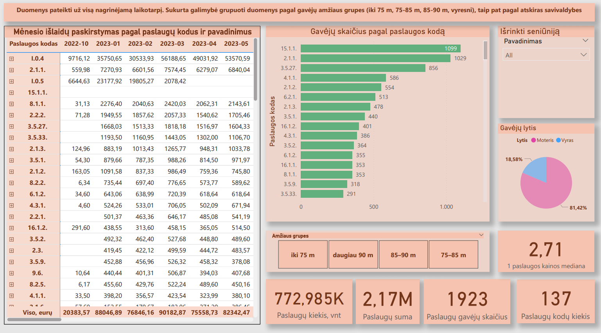
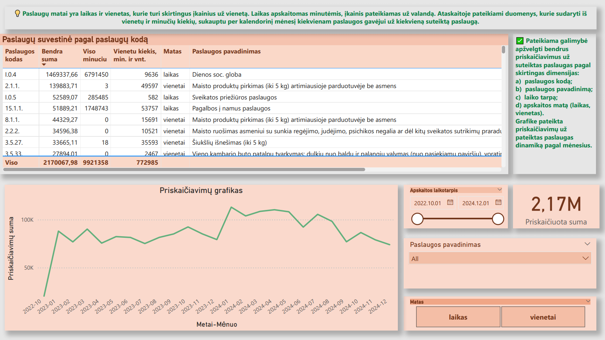
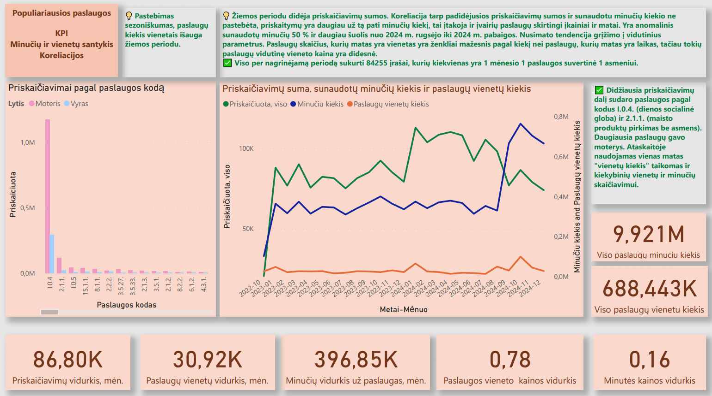

📊 Vilniaus m. socialinių paslaugų centro 2022-10-01 - 2024-12-01 paslaugų ataskaitos analizė su Power BI

Šis projektas skirtas **Analizuoti Vilniaus miesto socialinių paslaugų centro veiklą** naudojant **Power BI** vizualizacijų ir analitikos įrankius. Duomenys paimti iš **Lietuvos atvirų duomenų portalo**:  
🔗 [https://data.gov.lt/datasets/3801](https://data.gov.lt/datasets/3801)

---

## 🎯 Tikslai

Analizės metu buvo išsikelti šie tikslai:

- Identifikuoti teikiamas paslaugas, jų apimtį ir kainas
- Suprasti veiklos schemą, apskaitos ir paslaugų žymėjimo principus
- Parinkti tinkamus KPI 
- Atrinkti svarbiausius „Top“ rodiklius
- Patikrinti Pareto principo (80/20 taisyklės) taikymą
- Analizuoti paslaugų gavėjų struktūrą ir pasiskirstymą
- Vertinti veiklos efektyvumą
- Nustatyti ribinius ar netipinius duomenų atvejus
- Įvertinti rezultatus teisės aktų ir rinkos kontekste
- Įvertinti duomenų kokybę analizei
- Apibendrinti analizės rezultatus
- Pateikti įžvalgas ir rekomendacijas

---

## 📈 Naudotos priemonės

- **Power BI** (duomenų .csv gavimui, ataskaitų kūrimui ir vizualizacijai)
- **Python** (duomenų gavimui)
- **Lietuvos atvirų duomenų portalas**, **Lietuvos Statistikos departamentas** (pirminiam duomenų šaltiniui)

---

## 📌 Pagrindiniai rezultatai

- Vizualiai pavaizduotos paslaugos, paskirstymas, pajamos, klientų stuktūra
- Atlikta KPI analizė: klientų skaičius, vidutinė paslaugos kaina, paslaugų kiekis it t.t.
- Pareto analizė – identifikuota, kurios paslaugos sukuria didžiausią vertę
- Paslaugų efektyvumo įvertinimas pagal vienetus ar laiką
- Aptikti netipiniai atvejai ir duomenų trūkumai
- Suformuluotos įžvalgos bei rekomendacijos veiklos optimizavimui

---

