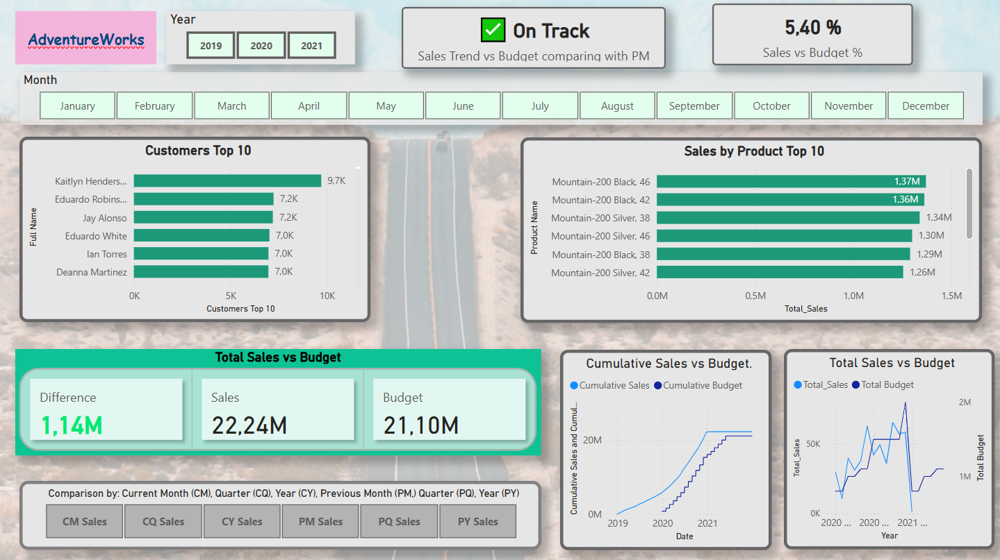
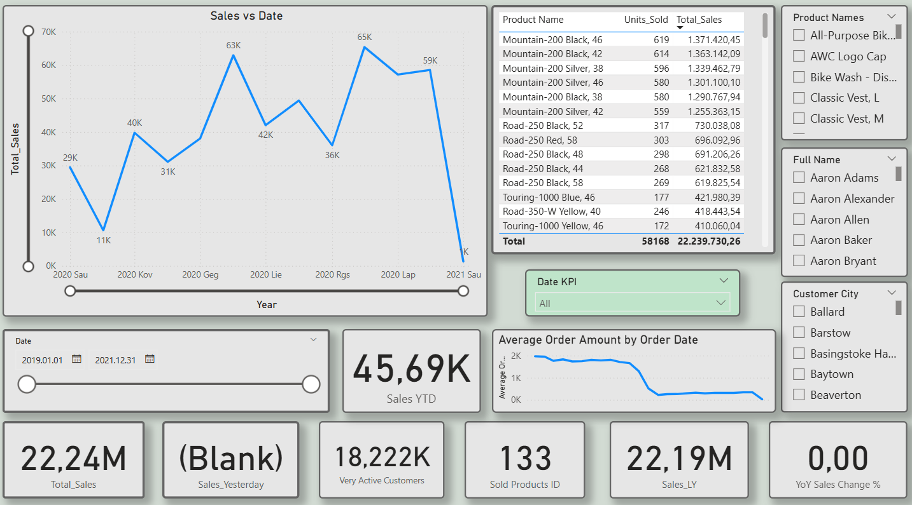
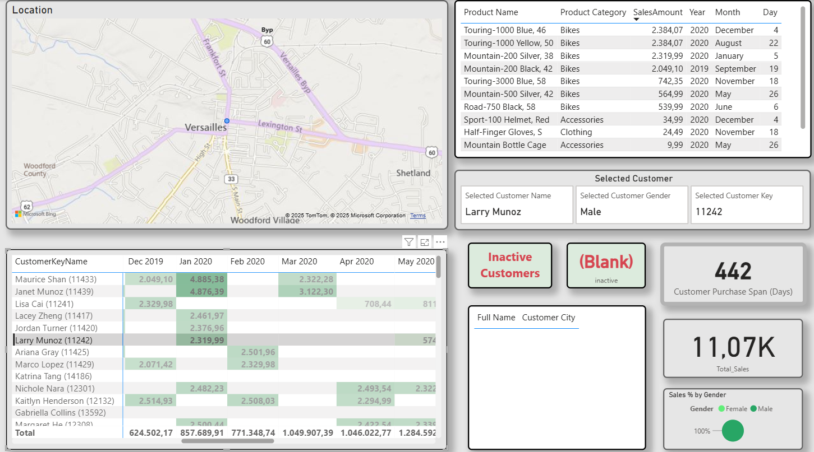
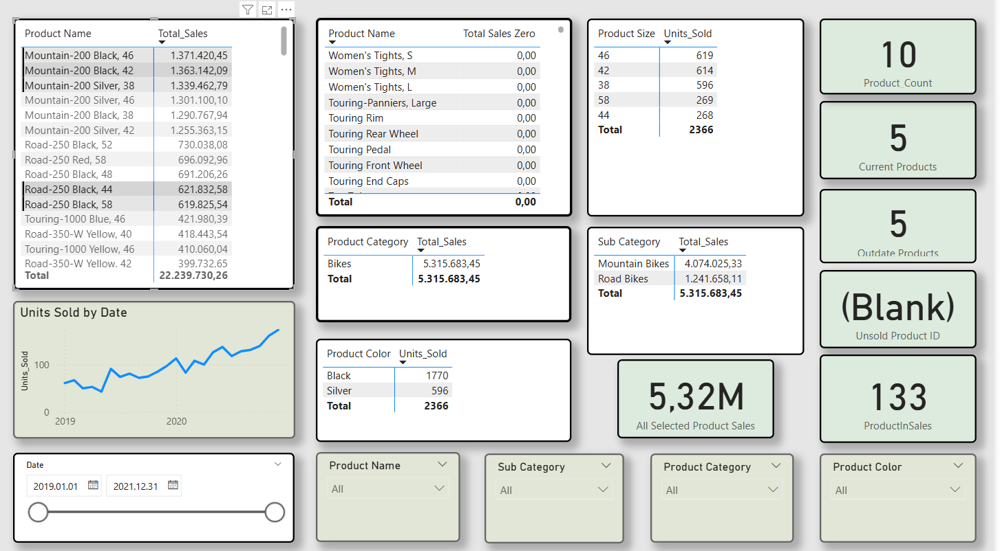
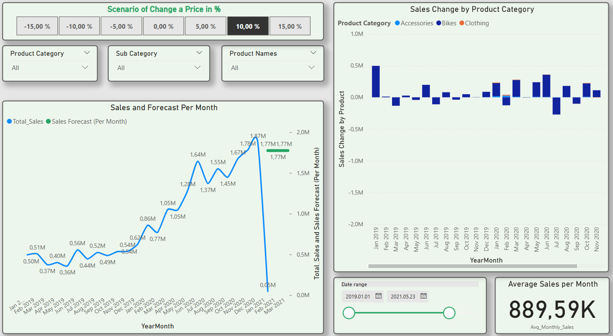

# 📦 AdventureWorks – Internet Sales & Forecast Analysis | Power BI Project

This Power BI report is built on the AdventureWorks Internet Sales dataset, focusing on customer behavior, product trends, performance vs. budget, and predictive sales forecasting. It helps sales, marketing, and financial teams better understand the full sales cycle — from actuals to strategic planning.

---

## 🎯 Project Goals

- Build a robust star schema data model for internet sales  
- Visualize sales performance and identify top products/customers  
- Measure performance vs. budget and spot trend reversals  
- Forecast future sales under different price scenarios  
- Provide behavioral segmentation of customers for marketing  

---

## 📊 Key Features

- 🧮 **Calculation Group with Finance KPIs**:  
  Current vs. Previous Month/Quarter/Year — all with dynamic filters  
- 📊 **Sales vs. Budget Comparison**:  
  See actual vs. budget values as totals and %; analyze KPI trend direction  
- 🚦 **Gap Shrink Indicator**:  
  KPI flags when actual sales exceed budget but are in decline — helps detect early warning signs  
- 📈 **Cumulative & Ongoing Tracking**:  
  Rolling totals of sales and budget performance  
- 💎 **Customer Behavior Intelligence**:  
  Loyal, occasional, sleeping buyers — color-coded by frequency and recent activity  
- 🔍 **Customer Explorer Page**:  
  Matrix with purchase dates, volumes, city, customer status, and all slicers  
- 🛍 **Top Products & Assortment Analytics**:  
  Product mix, unsold inventory, out-of-date SKUs  
- 📍 **Geo Mapping of Customer Purchases**:  
  Identify location-based sales trends  
- 🔮 **What-If Pricing Simulation**:  
  Forecast sales volume by adjusting prices for categories and sub-categories  
- 📉 **Predictive Forecasting**:  
  Projected sales under price change scenarios + advice for strategic discounts  

---

## 🧠 Business Insights

- Clearly segmented **customer types** (loyal, occasional, inactive) helped shape marketing strategies  
- Created a **“customer loyalty score” KPI** that flags buyers by frequency and recent activity  
- Enabled **customer-specific drilldowns** to analyze sales history, order amount, purchase frequency, and location  
- **Inactive customer lists** generated for potential re-engagement  
- Identified periods of **decreasing sales despite high performance** — highlighting when momentum slows  
- Compared **actual vs. budget** to find performance gaps and improvements  
- Provided **forecasted sales** based on price adjustment ranges with a “what-if” slider  
- Derived actionable advice: e.g., **temporary discounts can cover gaps** by attracting new demand  
- Side-by-side view of **actual vs. simulated predictive sales** allows informed strategic decisions  

---

## 🛠 Tools & Techniques

- **Power BI Desktop**  
- **Power Query** for data cleaning and transformation  
- **DAX Measures** and **Calculation Groups** (Time Intelligence, KPIs)  
- **Star Schema Modeling**: Fact + Dimension tables  
- **Custom KPIs & Trend Indicators** with color alerts  
- **What-If Parameters** for price sensitivity analysis  
- **Matrix, Map, Card, Line Chart, and Gradient visuals** for storytelling  

---

## 📂 Files

- `AdventureWorks_Sales_and_Forecast.pbix` – Main Power BI file  
- `images/` – Dashboard screenshots (recommended to include)  

---

## 📌 Learnings

This project significantly advanced my capabilities in:

- Building dynamic **KPI comparison models** using calculation groups  
- Detecting sales **trend reversals** using customized DAX alert logic  
- Creating **customer behavior segmentation** and converting it into marketing actions  
- Using **forecasting and simulation** to guide price and product strategy  
- Designing **narrative-driven dashboards** that guide users through “what happened” → “why it happened” → “what to do next”  
