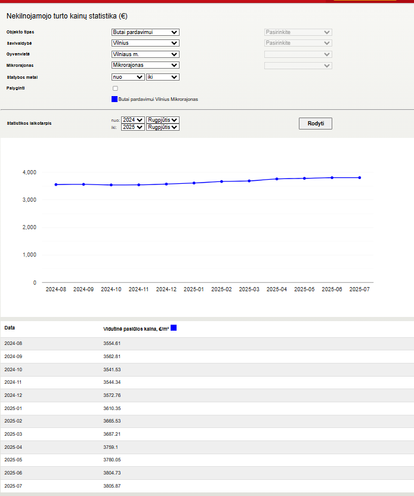
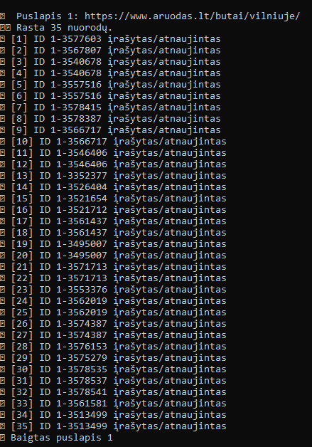
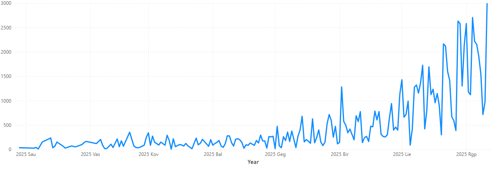
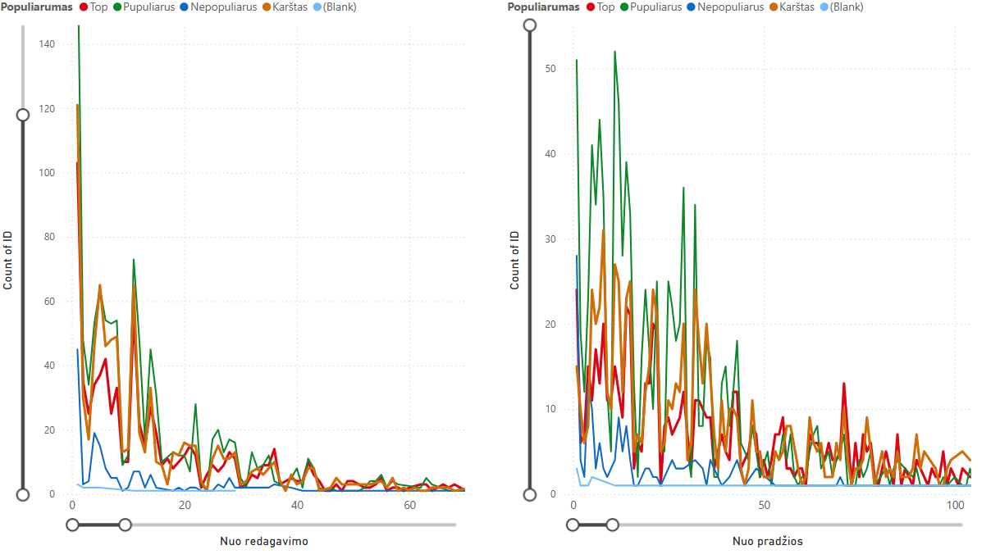
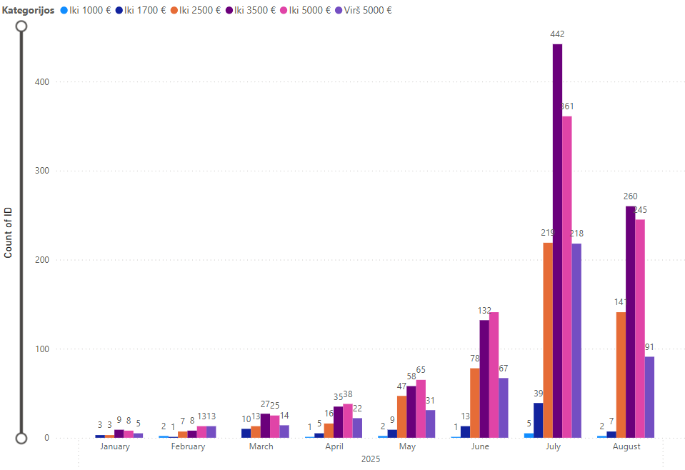
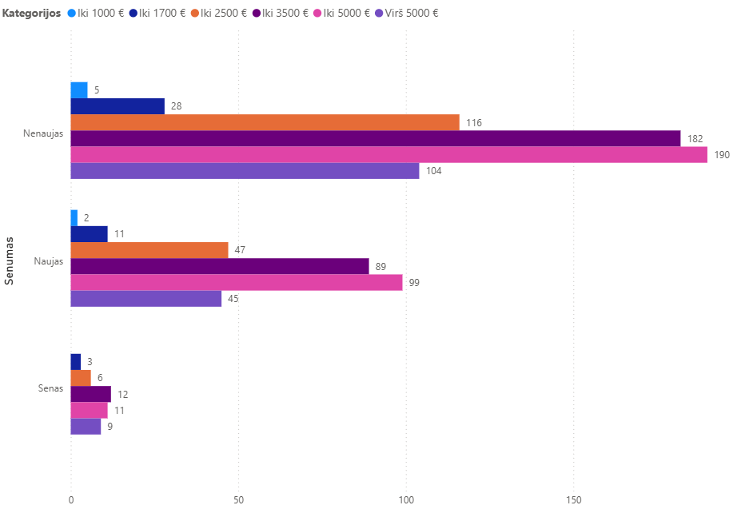
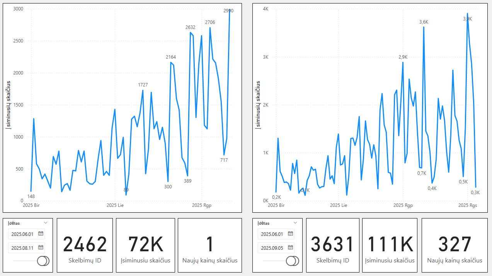
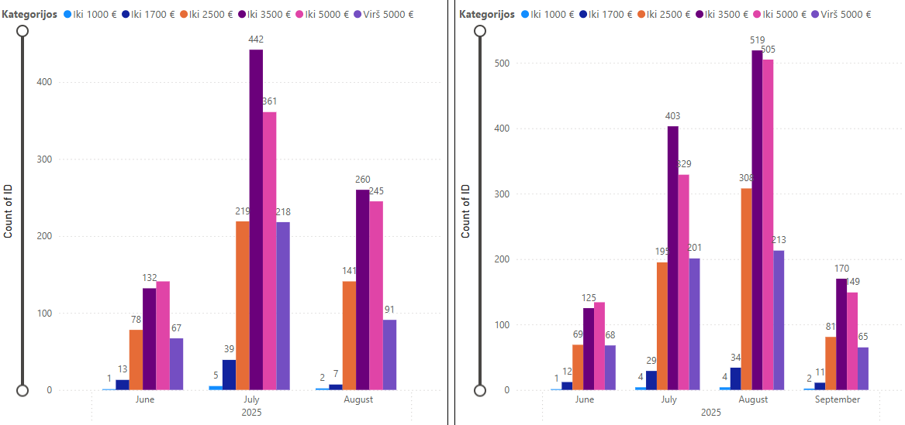
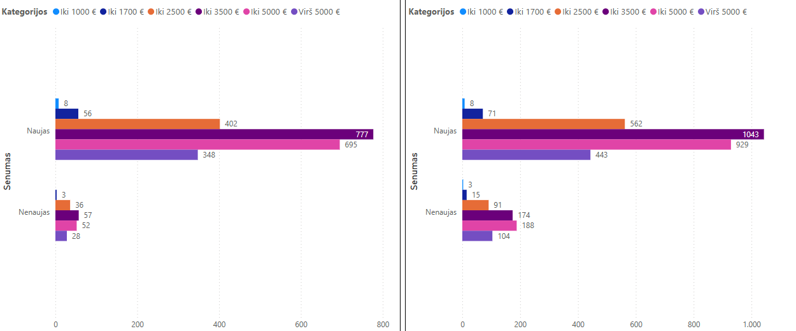

# Aruodas.lt duomenų gavimas naudojant „scraping“ metodą. Duomenų analizė.

**Aruodas.lt** – populiariausias nekilnojamojo turto portalas Lietuvoje, siūlantis daug struktūruotos informacijos apie pardavimo situaciją.  
Tačiau portalo viešai prieinama informacija yra sunkiai apibendrinama dėl kelių priežasčių:
- Pateikiami tik riboti statistiniai įrankiai.
  
  
  
- Informacija pateikiama skirtingais suvedimo moduliais (pvz., mažmeniniams pardavėjams ir NT vystytojams).
- Naudojamas dinaminis duomenų generavimo bei atvaizdavimo būdas, apsunkinantis automatizuotą duomenų paėmimą.

Populiariausias duomenų gavimo būdas – **„scraping“** – Aruodas.lt atveju yra komplikuotas.

---

## Sprendimas
Sukurtas **Python kodas**, imituojantis realaus vartotojo elgesį – puslapiai ir skelbimai peržiūrimi vienas po kito.  

Tokiu būdu galima gauti pradinius duomenis bei juos kaupti istorinei analizei.

---

## Tyrimo metodika
- **Duomenų struktūra:** iš anksto apibrėžta ir sudaryta taip, kad leistų atlikti nuoseklią kitimo stebėseną.
- **Atnaujinimai:** kiekvienas naujas „scraping“ pridės duomenis prie jau esančių, leisdamas atlikti istorines įžvalgas (pvz., kainos pokyčio stebėjimą).
- **Analizės prioritetas:** dėmesys sutelktas ne į kainų lygį, o į **pardavimo proceso dinamiką**.

**Analizuojami rodikliai:**
- Pardavimo laikas (sezoniškumas).
- Skelbimo redagavimo laikas.
- Kainos kitimas.
- Populiarumas (įsiminimų skaičius).
- Peržiūrų skaičius.

  Gilesnės įžvalgos bus galimos kai sukurta duomenų bazė bus papildyta atnaujinimais apie turimus bazėje skelbimus, ypatingai dėl skelbimo aktyvumo laiko

**Skaičiavimų vienetas:** Ploto kaina (EUR/m²), siekiant tikslesnio palyginimo.

---

## Duomenų grupavimas

**Pagal ploto kainą:**
- 1–1000 EUR/m²
- 1000–1700 EUR/m²
- 1700–2500 EUR/m²
- 2500–3500 EUR/m²
- 3500–5000 EUR/m² (dažniausiai naujos statybos)
- >5000 EUR/m²

**Pagal įsimintus skelbimus:**
- 1–5: *Nepopuliarus* (dažnai „širdeles“ deda patys skelbimo talpintojai).
- 5–20: *Populiarus*.
- 20–40: *Karštas*.
- >40: *Top*.

**Pagal galiojimo trukmę:**
- <60 d.: *Naujas*.
- 60–180 d.: *Nenaujas*.
- 180–300 d.: *Senas*.
- >300 d.: *Nepopuliarus*.

---

## Pagrindinės įžvalgos turto grupėje **Butai Vilniuje**:

### 1. Skelbimo įkėlimo laikas
- Didžiausias įsiminimų skaičius fiksuojamas pirmadieniais, mažiausias – savaitgaliais.

  
  
- **Rekomendacija:** naujus skelbimus kelti pirmadienio rytą, kol jie nenustumti kitų į žemesnes pozicijas.

---

### 2. Populiarumo dinamika ir redagavimas
- Populiarumas mažėja bėgant laikui, tačiau susidaro trys aiškūs klasteriai:
  - *Iki 50 d.* – aktyviausi skelbimai.
  - *50–100 d.* – vidutinio populiarumo, žemas reikšmių kitimas.
  - *> 100 d.* – mažiausio populiarumo.
- Skelbimo **Redagavimas** sukelia trumpalaikį susidomėjimo šuolį (iki 3 kartų didesnis įsiminusiųjų skaičius), tačiau:
  - efektas trunka iki 15 d.
  - po mėnesio susidomėjimo augimas gali tapti net mažesnis nei be redagavimo.
- **Išvada:** skelbimą redaguoti tik turint aiškią trumpalaikę pardavimo taktiką (akcija, nuolaida, svarbus pakeitimas).
---

### 3. Populiarumo stabilumas pagal klasterius
- Didžiausi svyravimai – „Populiarus“ grupėje (5–20 įsiminimų).
- Stabiliausias susidomėjimas – „Top“ grupėje (>40 įsiminimų).

---

### 4. Pasiūlos sezoniškumas (2025 m. tendencijos)
- Didžiausia pasiūla – liepos mėnesį, tačiau rugpjūtis žada viršyti šį rodiklį.
- Vartotojų susidomėjimas sparčiausiai auga segmente **2500–3500 EUR/m²**.

  
Tai rodo, kad dauguma pirkėjų pasiekė savo įperkamumo ribą iki 3500 EUR/m² ir laukia palankių akcijų.

---

### 5. Segmentų palyginimas
- Brangesnių butų pasiūla (~≥3500 EUR/m²) sudaro beveik pusę rinkos.
- Segmento 2500–3500 EUR/m² skelbimų per pirmus 6 mėnesius sumažėja ~75 %.
- Brangesnių butų skelbimų sumažėjimas per tą patį laikotarpį – apie 66 %.
- Skelbimai, kurių trukmė viršija 300 dienų, yra reti bet kuriame segmente.

---

## UPDATE 09-05, pirmi stebėjimo rezultatai
- Per vasaros laikotarpį skelbimų skaičius padidėjo 40%, atrinktus skelbimus įsiminusių skaičius pasidėjo 54%.
- 10 % skelbimų pakoregavo skelbimų kainas. Kainos ir didėjo ir mažėjo.

- Palyginus segmentuotus pasiūlos grafikus matosi liepos mėn. įkeltų skelbimų skaičiaus mažėjimas, skirtumas rodo mažėjimo skaičių.
- Rugpjūčio mėn. pasiūla toliau auga ir daugiausia paaugo butų kuriu kainų segmentas nuo 3500 iki 5000 eur/m2. Mažiausias augimas kainų segmente virš 5000 eur/m2.
- Rugsėjo pasiūla rodo augimo tendencijas

- Kainų segmentuose iki 1000 eur/m2 ir iki 1700 eur/m2 pasiūla išlieka žema.
- Kainų segmente virš 5000 eur/m2 pasiūlos padidėjimo skaičius panašią reikšmę padidino ir atsargas, kurios nusėdo ilgiau skelbiamų skelbimų segmente.
- Padaugėjo skelbimų, kuriu senumas yra nuo 60 iki 180 dienų. Prie padidėjusio susidomėjimo, tai gali reikšti vasaros laikotarpių atidėta pirkėjų apsisprendimą.

---

**Pagrindiniai analizės įrankiai:** segmentavimas, laiko intervalų nustatymas, vartotojų veiksmų identifikavimas.
