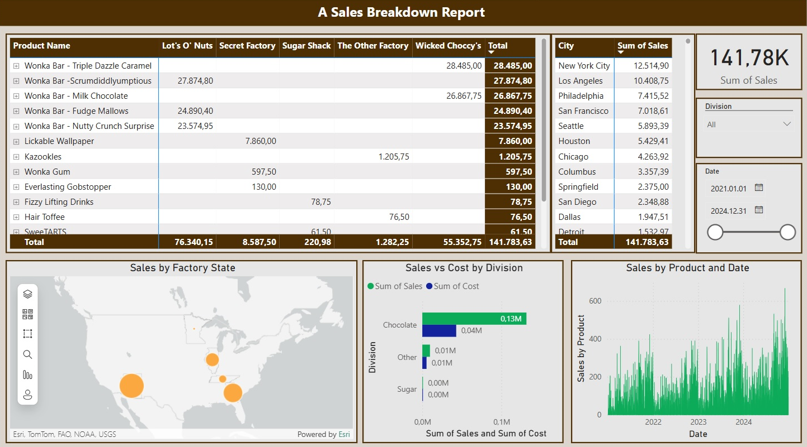
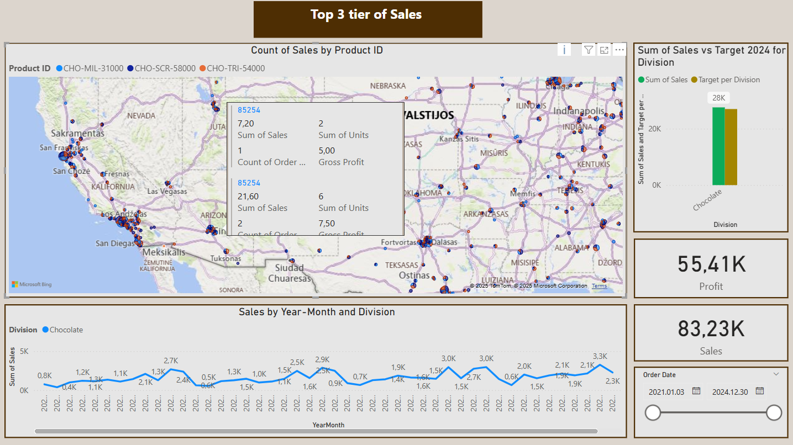
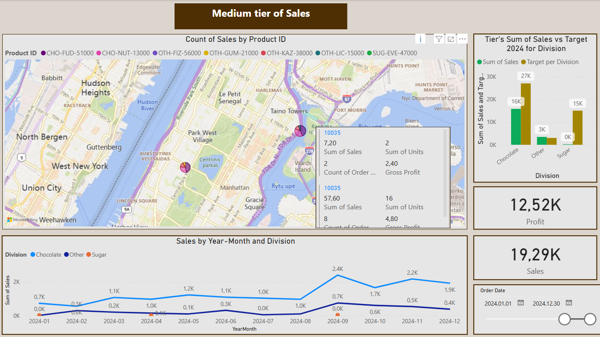
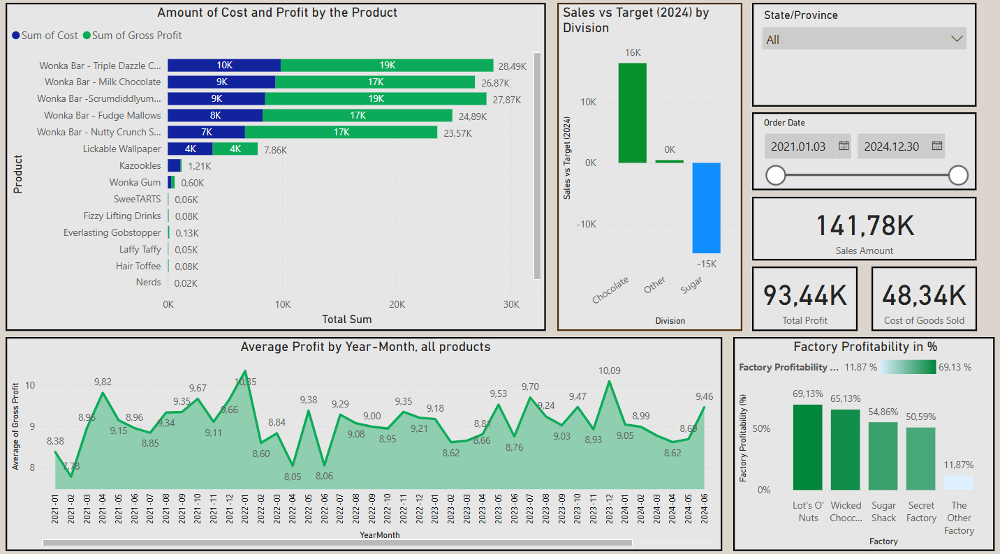

# 🍬 Candy Sales Tracker – Power BI Project

This Power BI dashboard analyzes candy sales data across different regions, product divisions, and time periods. It's designed to help sales managers and marketers track performance, identify trends, and make informed decisions. A training Data set for learning purpose.

---

## 🎯 Project Goals

- Visualize sales by product and region  
- Monitor seasonal trends and peak periods  
- Track performance of sales  
- Help identify top-performing products and regions  

---

## 📊 Key Features

- 📅 **Dynamic Date Filters**: Analyze data by day, month, or year  
- 📦 **Division Breakdown**: Compare sales across candy types (e.g., chocolate, sugar, other candy)  
- 🌍 **Regional Analysis**: Interactive map and tables to compare sales in regions  
- 🔄 **Comparisons**: Understand seasonal changes and growth  
- 🛠️ **KPI Measures**: Revenue, profit, top products, target of sales  

---

## 🧠 Business Insights

- Identified top 3 product categories contributing to 59% of revenue  
- Identified bottom and medium tiers of sales  
- Described sales by each product and each factory  
- Identified sales volume by city  
- Calculated sales versus cost of goods sold, described by division and by each product as well  
- Calculated average profit of sales, visualize profit by date  
- Identified profitability of each factory  
- Compared sales versus target of 2024 year  

---

## 🛠 Tools & Techniques

- **Power BI Desktop**  
- **Data Cleaning** in Power Query  
- **DAX Measures** for KPI change, cumulative totals, rank by region and product 
- **Responsive design** for usability in presentations  

---

## 📂 Files

- `Candy_sales_track.pbix` – Main Power BI file  
- `images/dashboard-preview.png` – Screenshot of the dashboard  

---

## 📌 Learnings

This project helped strengthen my skills in:  
- Data modeling and relationships  
- Creating custom measures with DAX  
- Designing intuitive dashboards that tell a business story  

---

## 🔗 Related Projects

- [AdventureWorks Sales Analysis](https://github.com/IgorLT67/igor-portfolio/tree/main/adventureworks-model)  
- [Airport Delays Dashboard](https://github.com/IgorLT67/igor-portfolio/tree/main/airport-delays-model)  
