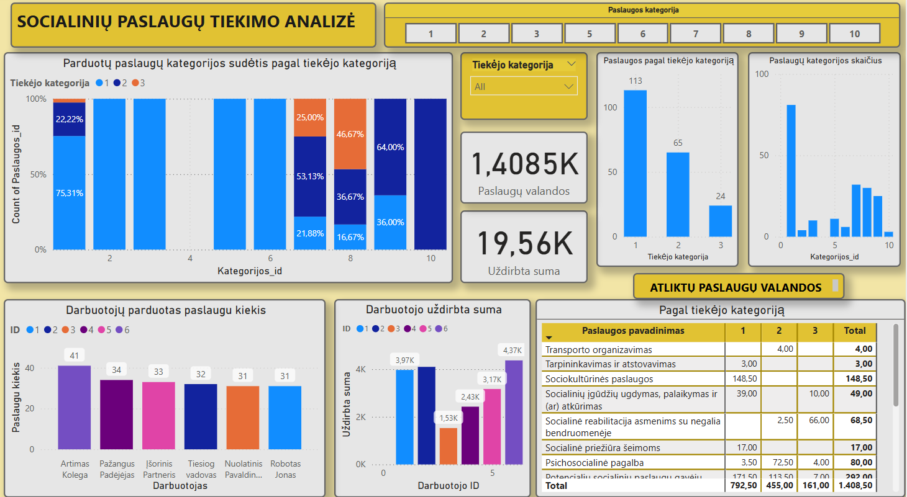
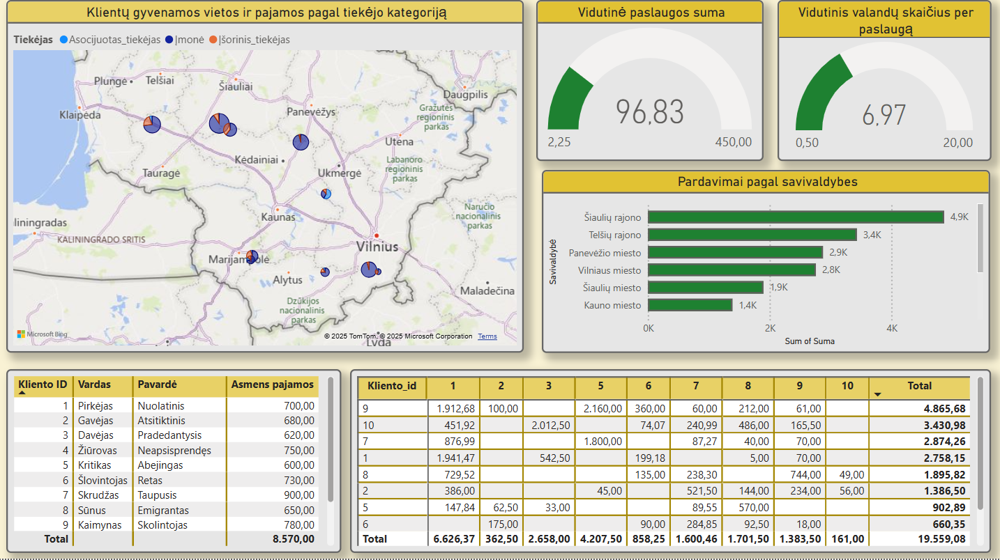
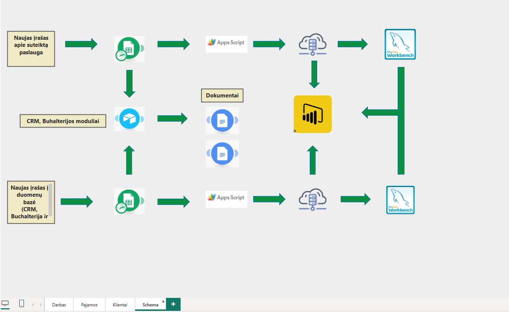

# 📦 Social care Business model – | Power BI Project

This project represents a real-world simulation of a social care service provider operating in Lithuania. It is designed as a dynamic dashboard built using **Power BI**, underpinned by a robust **MySQL database**, and integrated with **Google Sheets**, **Airtable**, and **Google Workspace** tools for end-to-end automation.

## 🌍 Project Overview

The project models a company offering **social care services at home or in public spaces**, not within institutions. The core activity is consultancy-based, fully aligned with **Lithuanian social care laws** and **personal data protection regulations**.

Services are based on:
- Standardized legal service definitions
- Individual customer requirements
- Average industry pricing and customized pricing tiers

## ⚙️ Key Features

### 💾 Database Architecture (MySQL)
- Built using **MySQL Workbench**
- Full relational database model
- Scalable: ability to add tables as complexity grows
- Includes:
  - Learning-level test data
  - Triggers and stored procedures
  - Cloud-hosted deployment for reliability and scalability

### 📝 Data Input System
- **Google Sheets**: Simplified, user-friendly work data input
  - Integrated via **Google Apps Script** to cloud MySQL
- **Data Separation**: Operational data input is separated from master/service data
- **Google Chat → Airtable**:
  - Chatbot input method for operational staff
  - Integrated with Airtable for CRM, Sales, and other modules

### 📄 Document Automation
- **Google Docs** templates generate reports after each work entry
- Files are automatically stored in **Google Drive**

### 📊 Power BI Dashboard
- Fully integrated with live data sources
- Dashboard Pages:
  - **Work Performance**
  - **Sales & Income vs COGS** – filterable by category, service, etc.
  - **Customer Overview** – complete client analysis with geographic service spread via map visuals
- Key Metrics and KPIs implemented
- Supports multi-source payments and municipality-specific billing schemas

## 🔧 Work in Progress
- Enhancing the **invoice generation model** to reflect municipality-specific pricing and rules
- Adding more automation layers for reporting and alerts

## 📌 Technologies Used
- MySQL / MySQL Workbench
- Power BI
- Google Sheets + Apps Script
- Google Docs / Drive / Chat
- Airtable

---

## 📬 Contact

For questions, feedback, or collaboration opportunities, feel free to reach out via GitHub Issues or email.
